# Зарубежные виртуальные карты для оплаты иностранных сервисов из России (2025-2026)

Подборка 16 сервисов, где можно оформить иностранную карту онлайн для оплаты подписок и покупок за рубежом. Актуальные условия, комиссии и способы пополнения.

С 2022 года российские банковские карты работают только внутри страны — ни оплат зарубежных подписок, ни покупок в иностранных интернет-магазинах. И тут закономерный вопрос: как платить за зарубежные сервисы, оформлять подписки, бронировать отели и вообще жить, если половина работы в интернете?

Этой проблемой сталкивается весь digital-сектор: маркетологи, арбитражники, блогеры, разработчики, продюсеры, дизайнеры — да кто угодно, кто пользуется международными инструментами. Мы тоже в этой лодке, поэтому разобрались, что сейчас работает, и собрали подборку сервисов, через которые можно оформить карты иностранных банков — виртуальные и физические — без выезда из страны.

Подборка включает три типа решений:

**1) Сервисы для выпуска виртуальных банковских карт зарубежных банков**

Самый быстрый и бюджетный вариант. Отлично подходят для оплаты ChatGPT, Steam, PlayStation Store, Netflix, Apple, Google, Zoom, Dropbox, Microsoft, Adobe, Booking, Spotify, WordPress, Miro и других сервисов.

Пример: [WantToPay](https://wanttopay.net/?pid=1H1OP) (выпускает виртуальные Visa/Mastercard, можно пополнять и сразу платить)

**2) Сервисы для оформления физических банковских карт на свое имя**

Это уже подороже и подольше, зато карта полноценная: можно снимать наличные, платить офлайн за рубежом, бронировать отели, машину, проходить KYC на площадках.

Пример: доставка карты, полноценный банковский счет

**3) Сервисы для покупки подарочных карт**

Когда нужно быстро и без заморочек пополнить баланс конкретного сервиса: Apple Gift Card, Amazon, Steam и подобные.

Пример: [GGsel](https://ggsel.net/), [Plati](https://plati.market/)

## WantToPay

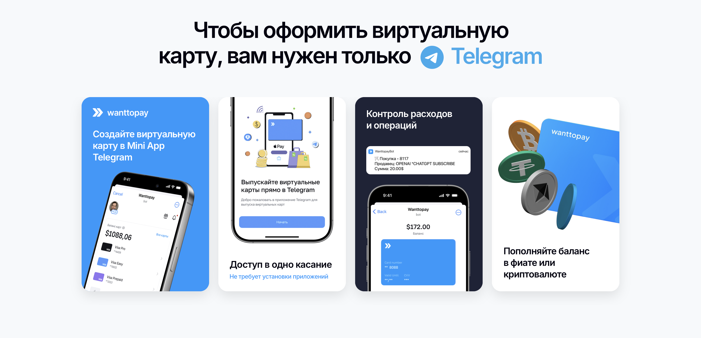

позволяет оформить зарубежные виртуальные и предоплаченные карты Visa и Mastercard прямо в Telegram — выпуск и управление происходят через мини-приложение.

У сервиса три тарифных линии: от простых предоплаченных карт до полноценной виртуалки с Apple Pay/Google Pay.

### Тарифы WantToPay

**Prepaid**

Предоплаченная карта Visa с фиксированным балансом.

- Номинал: 5-1000 $
- Стоимость выпуска: от 715 ₽
- Срок действия: 60 дней
- Обслуживание: бесплатно
- Возможность пополнения: нет
- Переводы и вывод средств: нет
- Apple Pay / Google Pay: нет

**Easy**

Виртуальная Visa с пополняемым балансом.

- Баланс: до 1000 $
- Стоимость выпуска: от 990 ₽
- Срок действия: 36 месяцев
- Обслуживание: 690 ₽ в месяц
- Возможность пополнения: да
- Переводы и вывод средств: нет
- Apple Pay / Google Pay: нет

**Pro**

Расширенная виртуальная Visa.

- Баланс: до 50 000 $
- Стоимость выпуска: 3490 ₽
- Срок действия: 60 месяцев
- Обслуживание: 690 ₽ в месяц
- Возможность пополнения: да
- Переводы и вывод средств: нет
- Apple Pay / Google Pay: да

### Пополнение и комиссии

Пополнение доступно:

- Через СБП — комиссия 5%
- Через банковские карты (P2P) — 0-5%
- Криптовалютой USDT, USDC, TON, BTC, ETH, BNB — 0% (только комиссия сети)

### Поддержка сервисов

В FAQ [WantToPay](https://wanttopay.net/?pid=1H1OP) есть актуальный список поддерживаемых платформ:

- Среди неподдерживаемых или непроверенных встречаются Xbox, Uber, TikTok Promote, Steam, Netflix, Etsy, BattleNet
- Большинство популярных сервисов оплачиваются, но иногда требуется определенный тариф карты

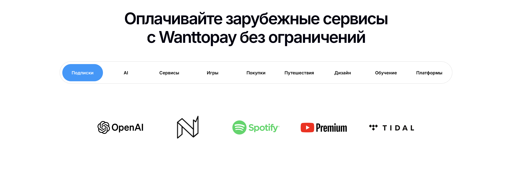

### Ограничения использования

Платежи запрещены:

- Сервисы 18+
- Финансовые услуги
- Продвижение акций
- Пирамиды
- Оружие
- Казино и азартные игры
- Торговля криптовалютой
- Продажа марихуаны

Карту нельзя использовать:

- В России
- В Белоруссии
- В Украине
- В Сербии
- В Пакистане

### Компания и репутация

Сервисом управляет гонконгская компания WTP Technology Limited. Оценки по площадкам сильно различаются: 4/5, 4,8/5, 2,5/5. Проверять отзывы лучше в соцсетях — у реальных пользователей видна история аккаунта и активность. Есть API для бизнеса — редкость среди подобных сервисов.

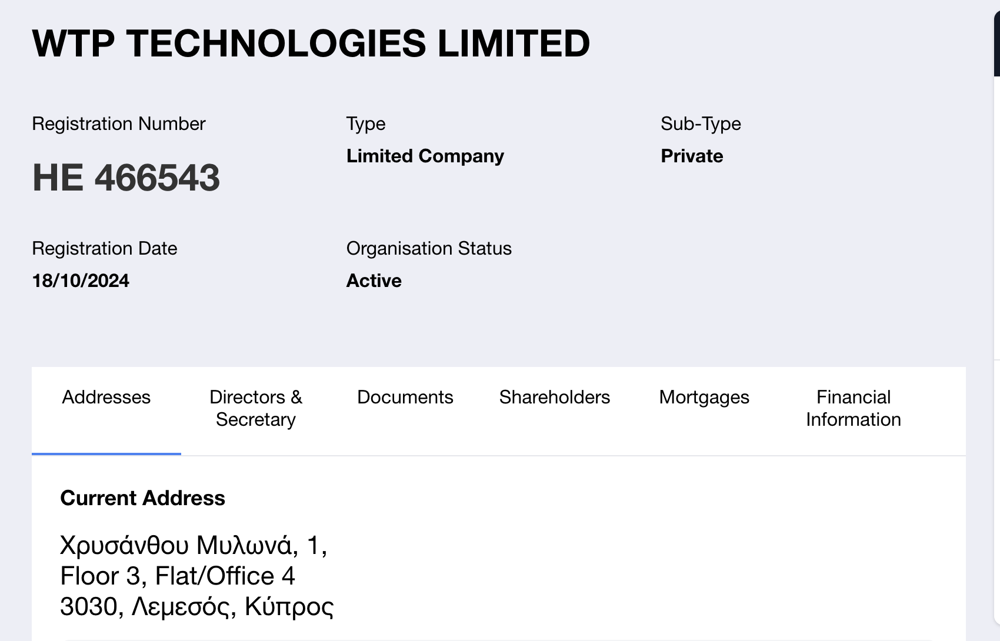

---

## 5КАРТ

[5КАРТ](https://5kart.ru/) — сервис, который оформляет карты зарубежных банков. Это лишь часть услуг компании: они также помогают с сопровождением ВЭД, получением иностранного гражданства и прочими юридическими вопросами. Но нас интересует именно выпуск карт — виртуальных и физических.

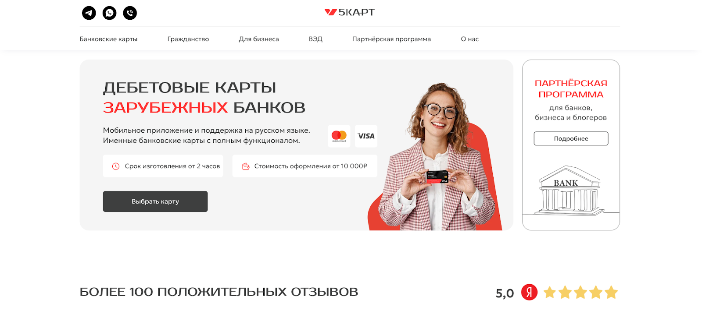

### Виртуальные карты

В линейке есть виртуальные карты для зарубежных платежей. Стоимость выпуска начинается от 10 000 рублей. Месячный лимит — около 1000 долларов. Обслуживание стоит 20 долларов в год. Срок действия — 1 год, а выпуск занимает один день.

Процедура оформления проходит без нотариальной доверенности — достаточно подтверждения по телефону Т-Банка, Газпромбанка или МТС Банка.

### Физические карты банков СНГ

Можно оформить карту одного из банков стран СНГ уровня **Visa Gold, Platinum или Infinite**. Стоимость выпуска — от 19 900 до 54 900 рублей.

Лимиты зависят от тарифной линейки: на снятие и покупки — от 8000 до 50 000 долларов. Комиссия за снятие наличных — от 1,5% до 3%. Обслуживание стоит от 18 до 450 долларов в год.

Сроки выпуска колеблются от пары часов до 20 дней. Карты поддерживают Apple Pay и Google Pay, некоторые — SWIFT-переводы. Физические карты подходят даже для аренды автомобиля. Для части карт требуется нотариальная доверенность, для части — нет.

### Ограничения и способы пополнения

Карты **не работают в России** — ни для оплаты, ни для снятия наличных. Снимать деньги можно только за пределами РФ.

Пополнение возможно через SWIFT, KoronaPay, карту «Мир», а также по номеру карты через Почта Банк и МТС Банк.

Оплатить услугу можно в рассрочку через Т-Банк.

### Процесс оформления

Оформление требует верификации личности и подготовки пакета документов. Их можно передать онлайн или принести в офис. Клиента сопровождает менеджер — общение идет в мессенджере.

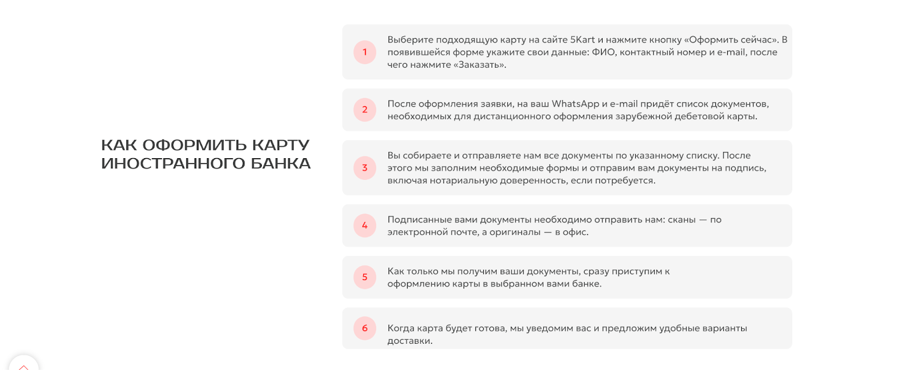

### Компания и репутация

Сервисом управляет ООО «Созвездие». Компания на рынке более 12 лет, выручка за 2024 год — 108 млн рублей. Проверка показала соответствие требованиям ЦБ. У компании есть офисы в Москве и Бишкеке.

Рейтинги заметно различаются: на «Яндекс.Картах» — 5,0 по 136 оценкам, на 2GIS — 2,6 по 10 оценкам. Разрыв существенный, но не уникален для компаний, работающих в чувствительных сферах.

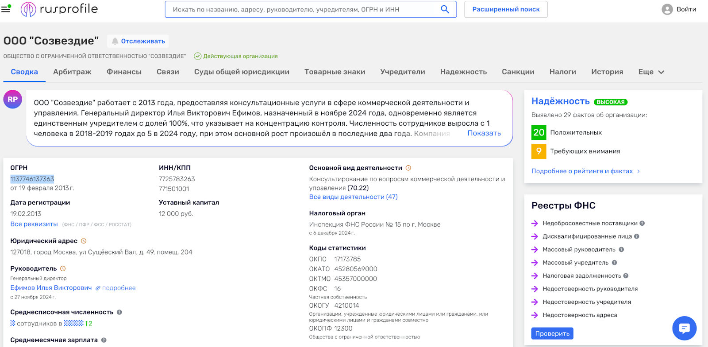

### Наш опыт и итог

Мы [5КАРТ](https://5kart.ru/) не пользовались, но во время видеосозвона видели реальный офис и сотрудников — это подтверждает, что компания не одноразовая.

Сервис подойдет тем, кому нужна **физическая зарубежная карта на свое имя** — для поездок, аренды, снятия наличных, оплаты офлайн-услуг. Но оформление физической карты дороже, требует раскрытия данных и, что важно, ежегодной отчетности перед российской налоговой.

Во всех остальных случаях гораздо быстрее, дешевле и проще воспользоваться анонимной виртуальной картой.

---

## Easy Payments

[Easy Payments](https://easypayments.online/) — сервис, который предлагает примерно тот же набор услуг, что и [5КАРТ](https://5kart.ru/): помощь с регистрацией компаний за рубежом, открытие бизнес-счетов в международных онлайн-банках, прием платежей, а также выпуск виртуальных и физических карт банков СНГ и Турции. По сути, это прямой конкурент предыдущей компании, со схожей логикой работы и условиями.

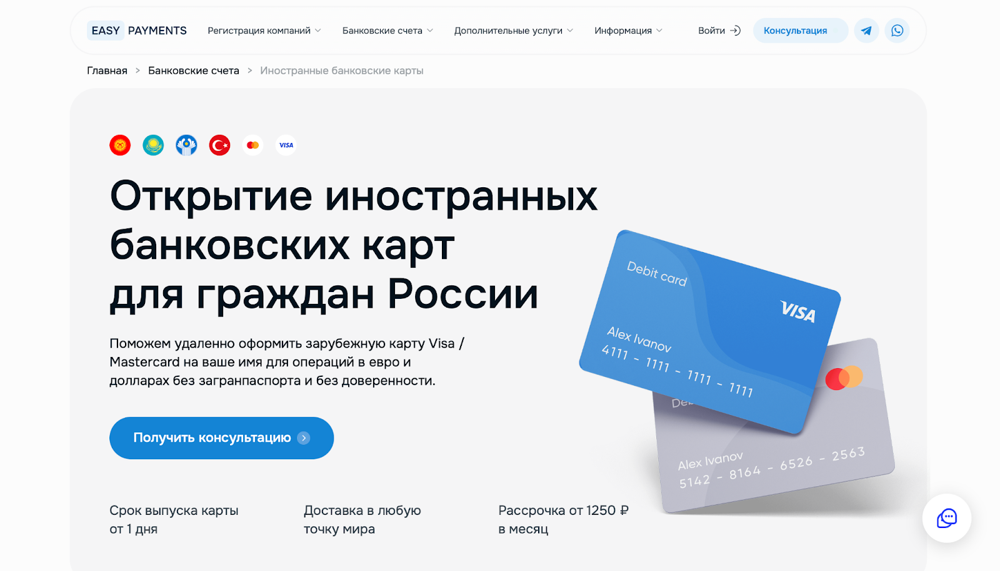

### Виды карт и условия

В линейке доступны карты Visa и Mastercard — как виртуальные, так и физические. Стоимость выпуска варьируется значительно: от 14 990 до 99 990 рублей в зависимости от уровня карты и банка-эмитента.

Лимиты на снятие наличных и покупки сопоставимы с предложением 5КАРТ — от 8000 до 50 000 долларов. Срок действия карт колеблется от одного года до пяти. Выпуск занимает от двух часов до 15 рабочих дней. Многие карты поддерживают Apple Pay и Google Pay, а большинство также дают доступ к SWIFT-переводам. Как и у конкурента, оплатить оформление можно в рассрочку через Т-Банк.

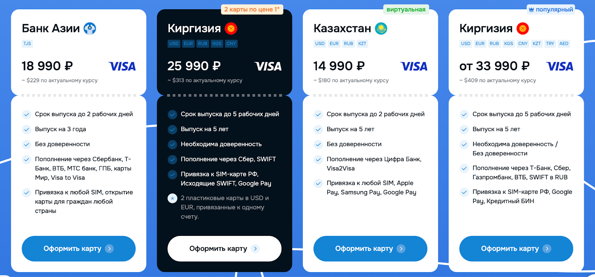

### Процесс оформления

Чтобы получить карту, нужно пройти верификацию, собрать пакет документов и передать их на проверку. Процесс сопровождает менеджер, общение обычно ведется в мессенджерах. Требования к документам в целом совпадают с требованиями [5КАРТ](https://5kart.ru/).

### Компания и репутация

Сервисом управляет ООО «Айти Ворлд». Формально юрлицо молодое — зарегистрировано менее года назад, но на сайте указано, что компания работает с 2018 года. Это может означать смену юрлица или реорганизацию. Выручка за 2024 год составила 45 млн рублей. Проверка показала соответствие требованиям ЦБ. География офисов такая же, как у конкурента: Москва и Бишкек.

По отзывам картина достаточно позитивная. На «Яндекс.Картах» — рейтинг 5,0 на основе 85 оценок; на Отзовике — 4,5 балла по 35 отзывам. Расклад выглядит реалистичнее, чем у некоторых более «стерильных» сервисов, но все равно требует аккуратности в интерпретации.

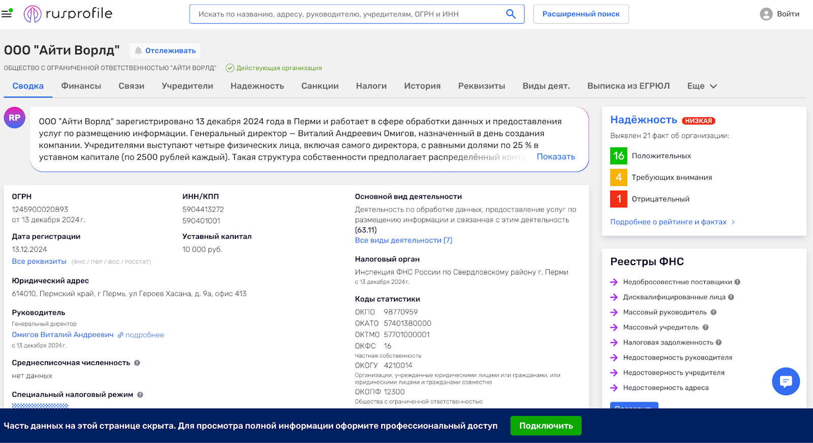

### Итог

[Easy Payments](https://easypayments.online/) — близкий аналог 5КАРТ по услугам, условиям и процессам. Оба сервиса предлагают физические зарубежные карты, которые подходят для поездок, аренды, офлайн-платежей и снятия наличных за пределами РФ. Однако физические карты стоят дороже, требуют раскрытия личной информации и обязательной отчетности перед российской налоговой.

Если цель — просто разовая оплата или подписка, куда эффективнее и дешевле использовать виртуальные карты. Если нужен полноценный банковский инструмент на свое имя, эти два сервиса можно рассматривать как равноценные варианты.

### Вывод

У нас [WantToPay](https://wanttopay.net/?pid=1H1OP) работал стабильно, но для безопасности лучше держать на карте минимальный баланс и пополнять перед конкретным платежом. После окончания срока карта удаляется вместе с остатком. У минимального тарифа срок всего 60 дней.

## GGSel

[GGsel](https://ggsel.net/) — крупный маркетплейс цифровых товаров, где собраны тысячи продавцов и огромное количество позиций: от подарочных карт и игровых ключей до пополнения Steam, оплаты ChatGPT, iCloud, Spotify и других сервисов. Это витрина, а не магазин, поэтому качество и условия зависят от конкретного продавца. У каждого — свои цены, способы передачи товара и подход к взаимодействию.

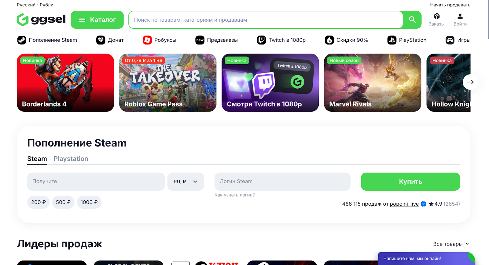

### Для чего подходит GGsel

Чаще всего сервис используют для пополнения Steam, покупки игровых аккаунтов и ключей, а также для приобретения подарочных карт, которые подходят для оплаты множества сервисов. Это гибкая площадка, где можно найти почти все, что относится к цифровым продуктам.

### Способы пополнения

Пополнение доступно через СБП, банковские карты, криптовалюту, WebMoney и другие способы. Комиссия зависит от метода оплаты и отображается перед покупкой.

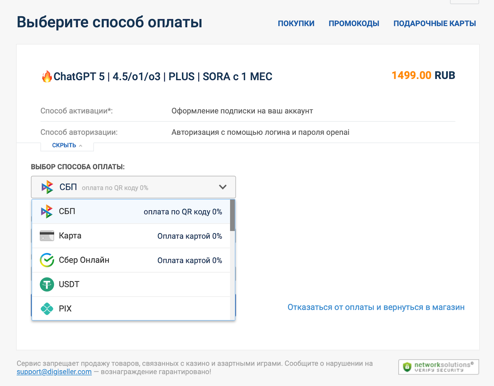

### Линейка продуктов

Товаров очень много, но основные категории легко выделяются. В разделе ключей и подарочных карт продаются лицензионные коды для Steam, PlayStation, Xbox, Epic Games и других площадок — чаще всего с автоматической доставкой, когда ключ появляется сразу после оплаты. Есть аккаунты — можно купить готовый или арендовать доступ на время; продавец присылает логин и пароль и пишет условия использования.

Отдельно вынесена активация: услуга для тех, кто не может подключить сервис самостоятельно. В этом случае покупатель передает продавцу временный доступ к аккаунту или просит активировать код от своего имени. Пополнение баланса — еще одна популярная категория: чаще всего это пополнение Steam с автоматическим зачислением средств.

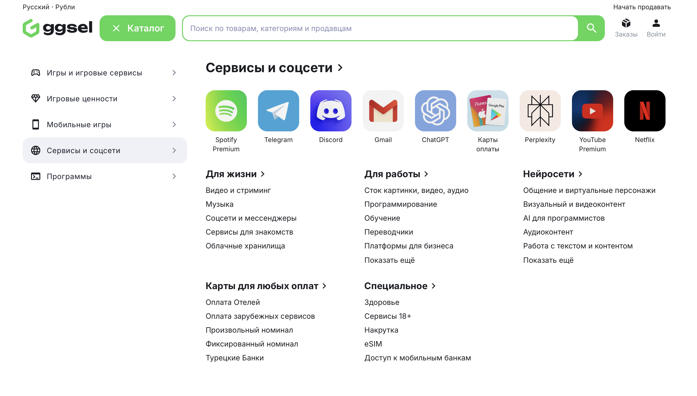

### Сколько переплатите

Переплата зависит от продавца, и иногда сильно. Даже по Steam на первой странице курсы могут отличаться в диапазоне от 1,04 до 1,25. Steam можно пополнить и напрямую, но курс и комиссия также меняются в зависимости от способа оплаты.

С ChatGPT ситуация похожая. На [GGsel](https://ggsel.net/) можно найти варианты с передачей логина и пароля примерно за 1499 ₽ (при официальной цене 20 $, около 1650 ₽), но встречаются и более дорогие предложения. Разброс по цене значительный, а комиссия у самого сервиса отсутствует — все внутри цены у продавцов.

### Технические особенности и юридические детали

GGsel работает поверх экосистемы Digiseller, а оплата и выдача товаров происходят через Oplata_info. Внешне может показаться путаницей, но логика простая: GGsel — витрина, где вы выбираете товар, Oplata_info — интерфейс оплаты и общения с продавцом, а Digiseller — система для продавцов и их учетных операций.

Поставщиков как таковых нет — каждый продавец самостоятельный. От мошенничества защищаются правилами: нельзя общаться с покупателями вне платформы, размещать фейковые отзывы, обещать «вечные гарантии» или выдавать себя за официального дилера. На сайте работает рейтинговая система, где видно количество покупок, отзывы и скорость решения спорных ситуаций.

Для некоторых товаров действует эскроу-логика: средства замораживаются у продавца до подтверждения, и их можно вернуть при наличии проблем. Споры решаются в два этапа: сначала претензия продавцу, затем — обращение в поддержку [GGsel](https://ggsel.net/).

За администрирование платформы отвечает ООО «Ай Ти Инвест». Компания зарегистрирована в Кыргызстане в мае 2023 года и имеет ИНН как в КР, так и в РФ.

### Возврат денег

Возврат возможен, если товар нерабочий или не соответствует описанию. Покупатель оставляет отзыв, обращается в поддержку, и запрос рассматривают до 72 часов. При положительном решении средства возвращают в течение пяти рабочих дней — сроки зависят от канала оплаты.

### Поддержка и репутация

На [GGsel](https://ggsel.net/) есть небольшой FAQ, но подробных инструкций не хватает — в основном приходится изучать карточки товаров или писать продавцам в личный чат. Можно обратиться и в поддержку маркетплейса: через всплывающее окно на сайте или по почте.

По отзывам картинка неоднозначная. Кому сервис нравится — хвалят цены, удобство сайта и скорость выдачи товаров. Кому не нравится — жалуются на продавцов-мошенников, удаление негативных отзывов, слабую службу поддержки и непрозрачность отдельных условий. GGsel при этом занимает первое место в рейтинге Exnode по качеству услуг, но в пользовательских обсуждениях единства нет.

## Plati

[Plati](https://plati.market/) — крупный маркетплейс цифровых товаров, где продавцы и покупатели взаимодействуют напрямую. Это не магазин, а скорее витрина: сервис не участвует в сделке и не отвечает за качество товара — вся ответственность лежит на продавце. Чем выше рейтинг продавца, подробнее описание и больше живых отзывов, тем безопаснее покупка.

### Для чего подходит Plati

[Plati](https://plati.market/) используют для покупки программного обеспечения, цифровых сервисов, игровых кодов, аккаунтов, подписок и различных цифровых продуктов. Это удобный способ оплачивать подписки и получать цифровые товары без ограничений по стране.

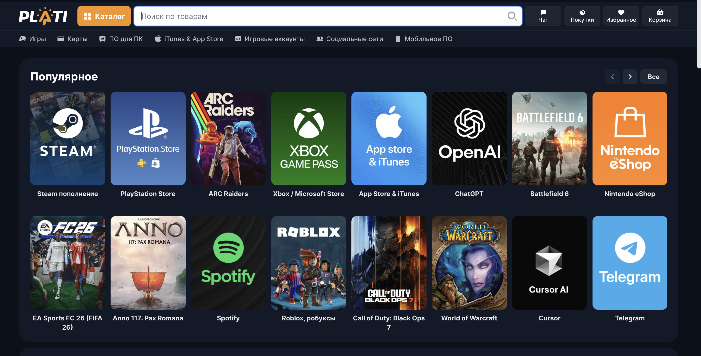

### Способы пополнения

Пополнение доступно через СБП, банковские карты, криптовалюту, Digiseller, WebMoney, UnionPay, Alipay, Turkish Bank и другие методы. Конкретная комиссия зависит от выбранного способа оплаты и отображается перед покупкой.

### Линейка товаров

На [Plati](https://plati.market/) продаются карты разных типов — фиксированные, произвольного номинала, предоплаченные или пополняемые. Есть большой выбор программ: от антивирусов до графических редакторов. На мобильном направлении — приложения, утилиты, баллы и подписки для iTunes и App Store. Для соцсетей доступны подписки YouTube, Discord, Twitch и других платформ. Продаются также курсы, базы данных, электронные книги и множество прочих цифровых товаров.

Страницы с товарами содержат описание, цену, отзывы, рейтинг продавца и инструкции по активации — это помогает быстрее оценить надежность.

### Сколько переплатите

Переплата зависит от продавца и способа оплаты. Например, подписка ChatGPT Plus стоит 20 $ (примерно 1650 ₽). На Plati новый аккаунт от топового продавца — 1899 ₽. Если нужно, чтобы оплатили через ваш логин и пароль — 2199 ₽. Оплата по ссылке — тоже около 2199 ₽. Итоговая цена формируется динамически, поэтому проверять нужно в момент покупки.

### Как работает площадка технически

Plati действует по той же схеме, что GGsel: витрина сайта, оформление через Oplata_info, а подключение продавцов — через Digiseller. Доставка цифрового товара происходит мгновенно: код или файл появляются в личном кабинете, а копия уходит на почту.

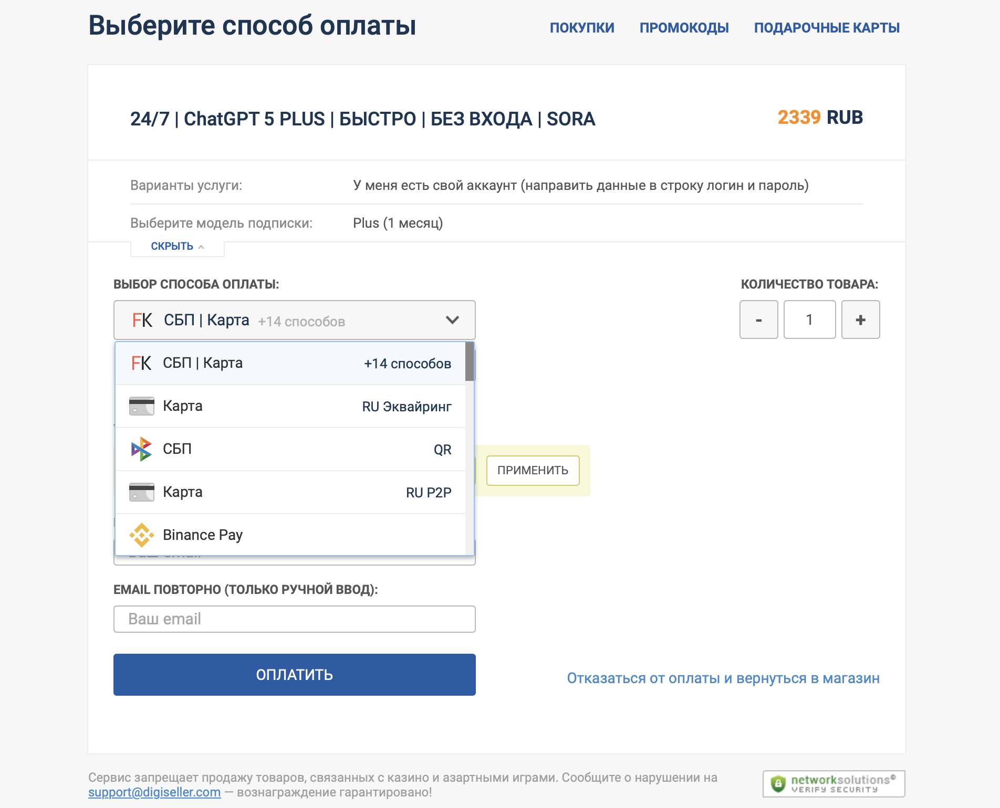

Продавцы — аттестованные пользователи WebMoney, то есть проходили идентификацию с паспортом и видео-селфи. Это снижает риск, но не исключает его полностью. Если товар не соответствует описанию, оставляют отрицательный отзыв. Если продавец не реагирует в течение суток, покупатель может обратиться к администрации. При большом количестве негативных отзывов товары автоматически блокируются.

Компания-владелец — INDX TRANSACTION LLC. Источники указывают разные юрисдикции: иногда фигурируют ОАЭ, иногда Сент-Винсент и Гренадины.

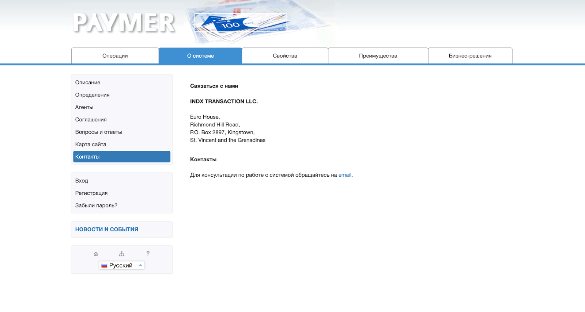

### Возвраты

Если товар не соответствует описанию, возможен возврат. Деньги могут вернуть на WebMoney, карту РФ, номер телефона российского оператора, USDT (TRC20) или подарочную карту Digiseller. Если покупка была через PayPal, работает политика PayPal. Если спор доходит до арбитража WebMoney или суда, [Plati](https://plati.market/) предоставляет данные сделки. При принудительном возврате удерживается комиссия 1,5%.

### Поддержка и репутация

На сайте есть базовые инструкции по покупке и получению товара, а связь с продавцами происходит через встроенные чаты. Telegram-бот дает информацию о популярных товарах и напоминает историю покупок, но полноценной поддержкой его не назвать. Есть Telegram-канал с новыми релизами, акциями и розыгрышами.

Рейтинги у площадки высокие, отзывов много. Покупатели чаще отмечают низкие цены и быстрые доставки товаров. Из минусов — случаи мошенничества со стороны отдельных продавцов, накрученные отзывы и слабая поддержка в конфликтных ситуациях.

## Остальные сервисы

Мы вынесли в начало статьи самые актуальные сервисы. Остальные — более нишевые, похожие по функционалу или менее проверенные — собрали в сокращенном формате.

**Mnogo Cards**

Предлагают виртуальные и физические карты банков стран СНГ и Турции. Стоимость — от 22 990 до 99 990 рублей. Срок оформления — от одного до 21 рабочего дня. Работают от имени ИП, офис находится в Москве. По сути, это небольшой оформительский сервис со стандартным набором услуг.

**Easycrds**

Оформляют карты Армении, Грузии, Киргизии, Турции, ОАЭ, Казахстана и ряда других стран. Стоимость — от 29 900 рублей до 319 900 рублей (самые дорогие карты — ОАЭ). Дополнительно можно приобрести сим-карту Киргизии за 5000 рублей или открыть брокерский счет в Казахстане за 10 000 рублей. Работают от лица ИП, офис — в Москва-Сити.

**PeoplePay**

Выдают виртуальные и физические карты банков Мексики, Молдовы, Казахстана, Азербайджана, Армении, Киргизии, Белоруссии и Турции. Можно оформить ИИН Казахстана. Стоимость услуг — от 6900 до 54 800 рублей. Управляются ИП, офис указан в Москве.

**Card Me**

Оформляют карты стран СНГ — виртуальные и физические. Стоимость — от 15 000 до 50 000 рублей. Управляет сервисом ИП. Указаны адреса в Москве, Алматы и на Бали, что скорее говорит о распределенной команде, чем о реальных офисах.

**KZPaycard**

Предлагают виртуальные и физические карты банков неуточненных стран. Стоимость — от 15 990 до 99 990 рублей. Управляют ИП из Казани. Информации минимум, сервис выглядит максимально «коробочным».

## Дополнительные сервисы для экзотических случаев

Ниже — сервисы, которые формально предлагают похожие услуги, но по разным причинам не подходят большинству пользователей из России и Белоруссии. Какие-то не прошли нашу проверку, какие-то работают только с иностранными документами, а некоторые просто слишком узкоспециализированные. Тем не менее оставляем их здесь — вдруг кому-то пригодится.

**PST**

Британский финтех-стартап, ориентированный на премиальный сегмент. Выпускают персонализированные карты Visa и Mastercard, эмитированные в США, с крупными лимитами и нулевыми комиссиями. Но входной порог высокий: обязательная строгая идентификация, подтверждение доходов, сканы документов, селфи с паспортом. С гражданами России и Белоруссии сервис не работает — они прямо это указали.

**Хcards**

Решение для бизнеса, вебмастеров и арбитражников, которым нужны карты для оплаты рекламы или приема платежей. Доступны Visa и Mastercard в долларах и евро с овердрафтом, 3-D Secure, SMS-информированием и API для автоматизации. Обещают моментальный выпуск и уменьшенную верификацию, но на практике — нет: процедура строгая, требует подтверждения личности, адреса, источника дохода и онлайн-интервью. Пользователи из России заблокированы на этапе регистрации. Подходит только обладателям иностранных паспортов и компаниям с зарубежной регистрацией.

**Pyypl**

Финтех-сервис из ОАЭ, работающий на рынки Ближнего Востока и Африки — Пакистан, Кения, Бангладеш, Нигерия. Предлагают виртуальные и пластиковые карты Visa, мобильный банкинг и переводы. Для наших реалий практически бесполезен: жесткая верификация гражданства и страны резидентства, высокие комиссии, маленькие лимиты, техподдержка, которой часто не дождешься, и упоминания о внезапных блокировках счета. Для россиян сервис работает плохо или не работает вовсе. Использовать его можно разве что при переезде в регион из списка.

**Wallester**

Эстонский финтех-сервис, ориентированный на корпоративных клиентов. По функционалу — мощная платформа: фирменные карты Visa и Mastercard для сотрудников, кастомизация дизайна, лимиты по категориям расходов, автоматические отчеты, API, интеграции с бухгалтерией, поддержка Apple/Google/Samsung Pay, мультивалютность и защита от мошенничества. Но для частных лиц это не вариант: дорогие тарифы, необходимость европейского юрлица и банковского счета, невозможность работать с российскими номерами телефонов, отсутствующая поддержка криптовалют. Инструмент подходит только компаниям, зарегистрированным в Европе.

**Volet (бывший AdvCash)**

Сервис для работы с криптовалютами, электронными платежами и форексом. Можно открыть мультивалютный счет и заказать карту, заточенную под крипту. Но репутация нестабильная: в отзывах упоминают блокировки аккаунтов, трудности с выводом, скрытые комиссии и тяжелую верификацию с кучей документов и требованиями подтверждать происхождение средств. Использовать стоит очень осторожно — если вообще стоит.

**Brocard**

Предоставляют дебетовые и кредитные карты для физических и юридических лиц. Проблема в том, что сервис сразу предупреждает: с резидентами России и Белоруссии они не работают. Для нашей аудитории сервис, по сути, бесполезен.

## Примерный план действий для открытия иностранной карты

Открыть виртуальную карту обычно просто: выбрали сервис, оплатили, получили реквизиты — никаких походов в офис и отчетности перед налоговой.

С физической картой иностранного банка все серьезнее: вы становитесь клиентом зарубежного банка, а заодно — счастливым обладателем новых обязанностей. Ниже — упрощенный план, как это обычно выглядит.

### 1. Выбор страны и банка

Сначала нужно определиться, где и в каком банке вы вообще хотите обслуживаться:

- Изучите страны, где сейчас открывают счета россиянам
- Посмотрите, какие банки готовы работать с нерезидентами и какие требования предъявляют к клиентам
- Обратите внимание на лимиты, комиссии, стоимость обслуживания и языковой барьер

Полезно заранее проверить, как именно банк относится к резидентам РФ и не изменялись ли правила за последние месяцы.

### 2. Подготовка документов

Набор может отличаться от страны к стране, но базовый список выглядит примерно так:

- Загранпаспорт
- Подтверждение адреса проживания и источника дохода (выписка из банка, справка о зарплате, налоговые декларации)
- Идентификационный номер страны банка (например, ИИН в Киргизии)

Иногда могут попросить дополнительные бумаги: трудовой договор, договор аренды жилья, справку с места работы, выписку за несколько месяцев и т. д.

### 3. Личный визит в банк

Дальше — офлайн-часть:

- Лично приходите в отделение и подаете заявление на открытие счета
- В некоторых странах документы и заявление нужно оформлять на местном языке
- Часто просят местный номер телефона, чтобы привязать его к интернет-банку и СМС-подтверждениям
- Почти всегда нужно внести минимальный первоначальный взнос на счет

Иногда банк может назначить отдельное собеседование с комплаенс-отделом — чтобы уточнить, кто вы, чем зарабатываете и зачем вам счет.

### 4. Получение карты

Сроки зависят от банка:

- Где-то карту выдадут сразу в отделении
- Где-то ее сделают за несколько дней
- Иногда карту могут отправить по почте, если вы не можете забрать ее лично

Параллельно вам подключат интернет-банк, мобильное приложение и СМС-уведомления — без этого пользоваться картой будет неудобно.

### 5. Уведомление налоговых органов РФ

Вот про это многие забывают, а зря.

По российскому законодательству резиденты РФ обязаны уведомить налоговую об открытии банковского счета за границей (ч. 2 ст. 12 Федерального закона от 10.12.2003 № 173-ФЗ). На это дается один месяц с даты открытия счета.

Подать уведомление можно:

- Через личный кабинет налогоплательщика
- Лично в инспекции
- По почте
- Онлайн с использованием электронной подписи

Кроме того, резиденты РФ обязаны ежегодно подавать отчет о движении средств по зарубежным счетам. Форма такого отчета утверждена Постановлением Правительства РФ от 12.12.2015 № 1365.

Если открываете счет и карту на свое имя в иностранном банке, это уже не «анонимная виртуалка», а полноценное банковское обслуживание — с юридическими и налоговыми последствиями. Это важно учитывать еще на этапе выбора страны и банка.

## Угрозы и риски

Оформление иностранной карты — удобный способ оплачивать зарубежные сервисы, подписки и покупки. Но вместе с удобством появляются и риски. Лучше знать их заранее, чтобы не попасть в неприятности и не потерять деньги.

**Риск блокировки карты или счета**

Блокировки — самая частая проблема. Причины могут быть разными: политика банка по отношению к нерезидентам, подозрение в обходе санкций, странные транзакции или просто неактивный счет, за который могут начисляться скрытые комиссии.

Чтобы снизить риски, используйте банки, которые лояльны к иностранным клиентам. Не делайте на карту крупных переводов — иностранные банки очень чувствительны к «нестандартным» операциям. Поддерживайте небольшую активность, оплачивайте повседневные покупки и не используйте карту в серых схемах.

**Проблемы с пополнением**

Иногда карта есть, а вот пополнить ее — уже приключение. Это может быть связано с ограничениями тарифа (например, отсутствие SWIFT), высокими комиссиями российских банков или недоступностью нужных платежных систем.

Перед оформлением уточните, чем именно можно пополнять счет, какие комиссии действуют и возможна ли оплата криптой или альтернативными системами.

**Риски, связанные с посредниками**

Если карта оформляется через посредника, появляется еще один слой неопределенности. Компания может оказаться недобросовестной, закрыться, потерять доступ к банку или просто перестать отвечать. Каналы пополнения могут быть заблокированы.

Проверяйте репутацию посредника по отзывам на сторонних площадках. Помните, что часть отзывов может быть куплена; оценивайте не только «звезды», но и детали: сроки, процесс, проблемы и решения. Подозрительно дешевые или чрезмерно быстрые предложения — красный флаг.

**Угрозы конфиденциальности и утечки данных**

Если посредник хранит данные карт без защиты, если сайт уязвим для атак, если вы вводите реквизиты карты на фишинговых страницах — есть шанс потерять все средства.

Меняйте PIN сразу после получения карты. Храните данные в менеджере паролей. Для онлайн-платежей лучше использовать виртуальные одноразовые карты. Старайтесь включать двухфакторную аутентификацию везде, где это возможно.

**Риск изменений в законодательстве**

Правила могут поменяться в любой момент — как в России, так и в стране банка. Может усилиться контроль над зарубежными счетами, может измениться политика банка к нерезидентам или могут ввести новые санкции против конкретных стран.

Следите за новостями, и держите в запасе хотя бы один-два альтернативных способа оплаты — чтобы не зависеть от одного инструмента.

## Итоги

Мы сознательно не стали включать в обзор все сервисы, которые нашли в процессе. Часть из них показалась слишком мутной или плохо проверяемой, а какие-то просто дублируют других игроков и не дают ничего нового.

Универсального решения не существует: ни одна карта и ни один сервис не закрывают все задачи разом. У каждого свои ограничения, комиссии, нюансы в работе с резидентами России и Белоруссии и свой «идеальный» пользователь.

Если нужна виртуальная карта на небольшую сумму — разово оплатить подписку, купить цифровой товар, протестировать сервис — подойдут быстрые решения вроде [WantToPay](https://wanttopay.net/?pid=1H1OP) и аналогов. Они оформляются через Telegram, работают без лишних вопросов и обычно позволяют пополнить карту с российских реквизитов. Но на таких картах не стоит держать крупные суммы: логика простая — пополнил, оплатил, обнулил.

Для долгосрочного использования, поездок, снятия наличных и привычных повседневных покупок больше подходят полноценные банковские карты на ваше имя. С их оформлением помогают сервисы вроде [Easy Payment](https://easypayments.online/) и [5КАРТ](https://5kart.ru/), а если хочется сэкономить и вы готовы к бюрократии, можно попробовать открыть счет и карту в зарубежном банке самостоятельно.

При этом важно помнить: чем серьезнее инструмент, тем больше волокиты с документами и обязанностей перед налоговой. Банк-эмитент и посредника нужно выбирать максимально внимательно, не по первой красивой рекламе.

В любом случае стоит придерживаться базовых принципов безопасности и здравого смысла:

- Внимательно читать условия и тарифы, смотреть на комиссии и лимиты
- Изучать отзывы на независимых площадках и в социальных сетях
- Проверять репутацию сервиса и юрлица, которое стоит за продуктом
- Уточнять требования к верификации и документам до оплаты услуг
- Скептически относиться к обещаниям «кэшбека без условий» и откровенной халявы
- Держать запасной способ оплаты на случай блокировок и сбоев
- Не рисковать суммами, потеря которых будет для вас критичной

Вся информация в этой статье носит ознакомительный характер и не является финансовой рекомендацией или побуждением к действию. Мы лично пользовались только частью из перечисленных сервисов. Любые решения с деньгами и повышенными рисками каждый принимает сам — взвешивая не только выгоды, но и возможные последствия.

