# 22 Affordable VPS/VDS Hosting Providers for Personal and Business Use (2025-2026)

Looking for cheap VPS hosting that's fast, reliable, and fits both personal and business projects? We've reviewed more than 20 trusted VPS and VDS providers and compared them by pricing, uptime, features, and support.

## Why Your Own Server Is More Than Just Hosting

A VPS — or Virtual Private Server — isn't just a service. It's a powerful and affordable tool that gives you full control over your online project.

VPS hosting is essentially a high-performance computer that you rent remotely. It's physically located in your provider's data center, but you have complete access to it. In other words, it's your personal remote machine — ready for anything from hosting websites to running custom applications.

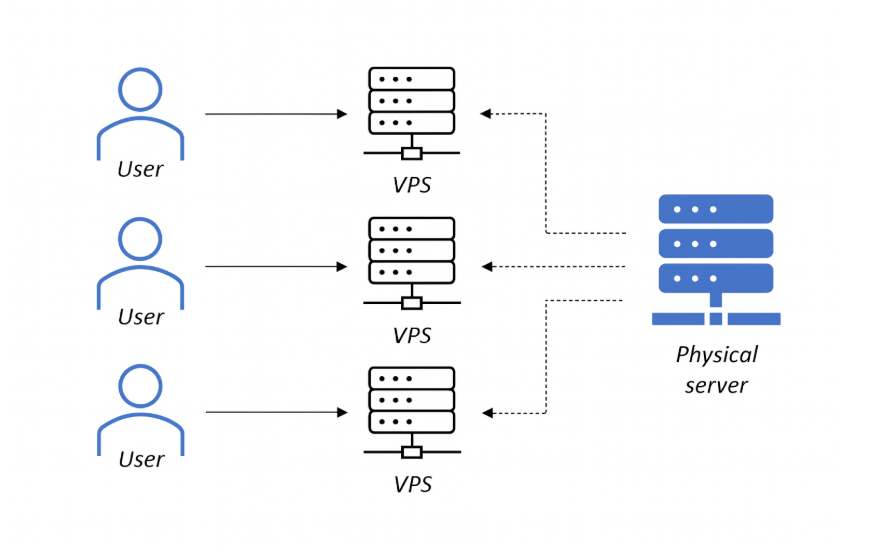

## Types of Hosting

**Shared Hosting** — the simplest and most affordable option. Here, multiple websites share the resources of a single physical server. If one of your "neighbors" runs into issues — say, spikes in traffic or errors — it can affect your own site's performance. You also can't install custom software, and the amount of RAM and CPU you can use is limited. This type of hosting is suitable only for personal or small test projects.

**VPS Hosting** — on a powerful physical server, several isolated virtual machines are created. Each of them operates independently, with dedicated resources guaranteed for each user. That means no noisy neighbors and stable performance. VPS is a reliable, flexible, and manageable hosting solution — perfect for growing blogs, online stores, and business services.

**VDS (Virtual Dedicated Server)** — an even more robust and high-performance solution, ideal for large companies. The key difference from VPS lies in the virtualization technology: VDS uses hardware-level virtualization, giving each virtual server its own kernel and operating system. This ensures maximum reliability and performance.

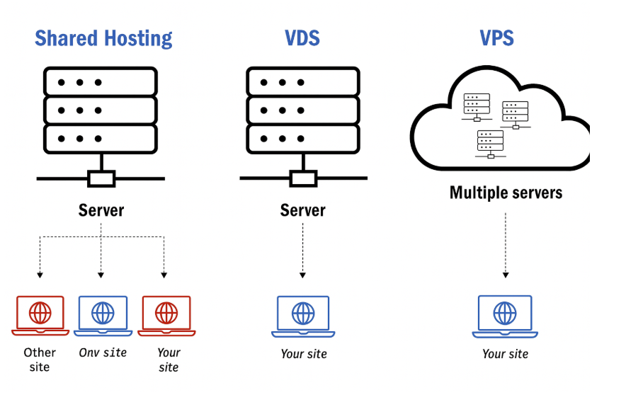

### Why VPS Is Worth It

Unlike shared hosting, where you compete for resources with hundreds of other sites, VPS gives you your own isolated environment.

- You get full root access and the freedom to install any software — from websites and databases to game servers.
- You have total control over your traffic, which means you can create a secure private network and ensure top-level data protection.
- This flexibility allows you to run any type of project — even your own private cloud storage.

### What's Inside This Guide

In this guide, we've analyzed 22 affordable VPS hosting providers to help you find the perfect match for your needs. We've compared key factors like pricing, jurisdiction, server locations, and payment methods (including cryptocurrency). At the end, you'll also find recommendations on which hosting options work best for specific use cases.

**Save time** — [jump straight to the comparison table](https://docs.google.com/spreadsheets/d/1c_bEeXJNfX2eExUPGdKg67DKLJ5wlzZAv06BxwbqKbk/edit?usp=sharing).

## In-Depth Hosting Provider Review

Ready to dig deeper? Below, you'll find detailed breakdowns of over two dozen VPS and VDS providers — from local champions to global heavyweights.

Each review covers what really matters: uptime, speed, transparency, tech stack, and, of course, how support behaves when things go south.

No marketing gloss, no generic "best of" lists — just real-world insights and verified facts.

You'll see which hosts deliver solid value and which ones crumble under load (or bureaucracy).

Think of it as your personal field guide to picking a server that won't let you down — whether you're running a side project, e-commerce store, or full-blown SaaS.

## is*hosting

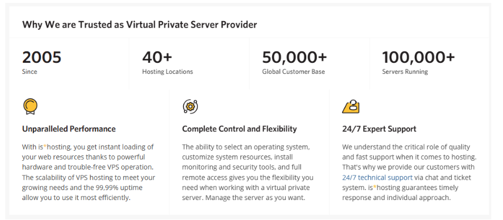

[is*hosting](https://ishosting.com/affiliate/NTkyOCM2) presents itself as a seasoned provider offering a scalable, globally distributed infrastructure. The company highlights its extensive network of 41 data centers across five continents.

Such broad coverage lets you host your projects closer to your target audience — cutting down latency and boosting website loading speed.

The provider claims to use its own high-end hardware and brings over 20 years of industry experience to the table. Its portfolio includes VPS and dedicated servers, along with extra services like data storage and secure network access.

[is*hosting](https://ishosting.com/affiliate/NTkyOCM2) also offers free project migration, which is a nice perk.

However, there's no clear information on a money-back guarantee or trial period mentioned on the website.

Opinions on performance are mixed. Some users complain that the servers are "painfully slow."

At the same time, experts at HostAdvice ran their own tests and got impressive results — blazing-fast disk performance (2760 IOPS) and low latency.

Customer support also gets conflicting reviews. One person says it took them "way too long" to get a reply, while others call the support team "perfect" and "responsive," noting that it's available 24/7 via tickets, email, and other channels.

In short, both user feedback and expert evaluations of is*hosting's performance and support vary quite a bit.

### Key Evaluation Parameters

**Jurisdiction:** Estonia

**Founders:** WEBRAIN OÜ

**Founded:** 2005

**Revenue:** Not disclosed

**Data Centers & Locations:**

is*hosting operates data centers worldwide — including major U.S. cities like New York, Chicago, Los Angeles, Tampa, and Dallas, as well as Tallinn (Estonia), Frankfurt (Germany), Prague (Czech Republic), and Gdańsk (Poland).

They rely on infrastructure from top-tier providers such as Digital Realty, Equinix, and Telehouse, among others.

**Popular Plans:**

VPS from $5.94/month, Dedicated Servers from $75.00/month

**Money-Back Guarantee:**

Available only to EU clients, within 14 days

**Free Trial:**

Not available

**Payment Methods:**

Visa, Mastercard, cryptocurrencies, QIWI, UnionPay, Boleto, Alipay, and bank transfers

**Key Features:**

NVMe storage, unmetered traffic, free DDoS protection

**Additional Services:**

Fully managed VPS/dedicated servers, VPN, SSL certificates

**Supported Software:**

ISPmanager, VestaCP, DirectAdmin, and a wide range of Linux distributions — Ubuntu, Debian, AlmaLinux, CentOS, and Rocky Linux.

Also supports Windows (unlicensed) and licensed versions including Windows 7, 10, and Windows Server editions from 2008 R2 to 2019 R2.

**Security History:**

No known breaches reported.

## Aeza

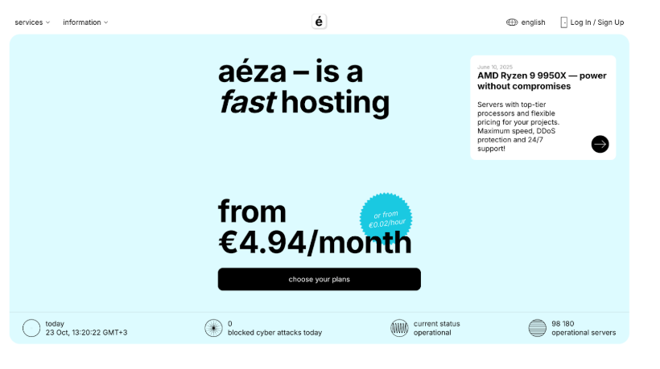

[Aeza](https://aeza.net/?ref=723275) is a young but ambitious cloud hosting provider offering virtual (VPS/VDS) and dedicated servers, targeting both beginners and experienced users. The company claims to use modern hardware (NVMe storage, powerful processors), provides hourly billing, DDoS protection, and supports a wide range of payment methods.

Among its strong points, users highlight high server speed, stability, and responsive support. One review even notes that "the server flies" and praises support for being "quick and to the point."

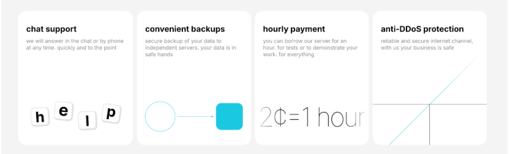

However, there are also some concerns. Aeza's legal transparency raises questions: the website lists Moldova as the place of registration, but contact details point to another legal entity in Romania.

In 2025, the U.S. Department of the Treasury placed the Aeza Group on its sanctions list for allegedly providing hosting infrastructure linked to cybercrime operations.

Some reviews also mention unexplained server suspensions and slow response times from customer support.

### Key Evaluation Parameters

**Jurisdiction:** Moldova / Romania

**Founder:** Andrei Topal

**Founded:** 2019

**Revenue:** Not disclosed

**Data Centers & Locations:** Own data center in Chișinău (Moldova); partner locations in Zurich (Switzerland), Amsterdam (Netherlands), Kyiv (Ukraine), Chicago (USA), and Dubai (UAE)

**Popular Plans:** VPS from ~$7.60 per month; Dedicated Servers from ~$29.99 per month

**Money-Back Guarantee:** Instant refund promised; however, refunds are not available for add-on services, licenses, ToS violations, or DDoS-related suspensions

**Free Trial:** Not available

**Payment Methods:** Credit cards (Mastercard, Visa), bank transfers (SEPA, SWIFT), Google Pay, Paynet, and cryptocurrencies (Bitcoin, Ethereum, Monero, Tether, etc.)

**Key Features:** Proprietary hardware, KVM virtualization, 99.99% uptime guarantee

**Additional Services:** Private VPN, Windows VPS, Binance VPS, Storage Box

**Supported Software:** Linux (e.g., Ubuntu), Windows (Windows Server 2019), hosting panels (HestiaCP, cPanel, DirectAdmin, Plesk, Virtualmin)

**Security History:** No breaches reported

## VDSina

[VDSina](https://www.vdsina.com/?partner=2923xwgn6ki2) presents itself as a cost-effective and flexible hosting provider offering virtual (VPS/VDS) and dedicated servers. The company focuses on delivering accessible, high-performance infrastructure for both personal and business use.

It offers flexible configurations — up to 128 vCPUs, 512 GB RAM, and NVMe storage — with instant activation and pay-per-day or monthly billing options. VDSina emphasizes simplicity, automation, and scalability, making it easy to launch servers quickly without dealing with complex setup.

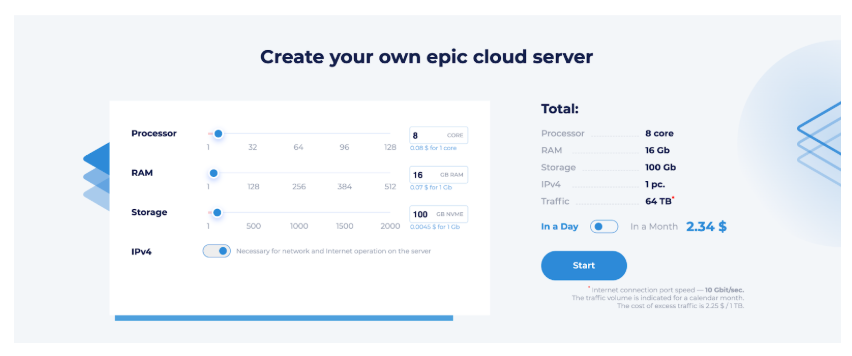

The provider claims to use modern hardware and KVM virtualization, along with built-in DDoS protection and the ability to upload custom ISO images. Users highlight strong uptime and good speed-to-price ratio, noting that the service performs stably for extended periods without interruptions.

However, there are downsides. VDSina does not offer a free trial, and refund requests are often denied. Some users complain about inconsistent support quality and unexpected changes to service terms. Despite mentioning multiple data-center locations, the main infrastructure is concentrated in Russia and the Netherlands.

Overall, VDSina delivers affordable and stable hosting for tech-savvy users who value flexibility and speed over premium support or guarantees. It's a good fit for developers, testers, or small projects that need reliable uptime at minimal cost.

### Key Evaluation Parameters

**Jurisdiction:** Russia

**Founders:** Not disclosed

**Founded:** 2014

**Revenue:** Not disclosed

**Data Centers & Locations:** Moscow (Russia), Amsterdam (Netherlands)

**Popular Plans:** VPS from ~150 ₽/month (≈ $2–3) for 1 vCPU, 1 GB RAM, 10 GB NVMe

**Money-Back Guarantee:** Not available; refunds rarely approved

**Free Trial:** Not available (daily billing option provided)

**Payment Methods:** Visa, Mastercard, MIR, WebMoney, Qiwi, cryptocurrencies

**Key Features:** NVMe storage, KVM virtualization, fast deployment, custom ISO support, scalable resources

**Additional Services:** Dedicated servers, GPU servers, "lifetime" one-time-payment VPS

**Supported Software:** Linux (Ubuntu, Debian, CentOS), Windows Server, custom ISO images, control panels

**Security History:** No recorded breaches

## Cherry Servers

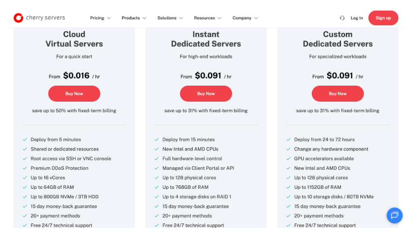

[Cherry Servers](https://www.cherryservers.com/?affiliate=P47HQZS0) presents itself as a powerful cloud and bare-metal hosting provider tailored for developers, startups, and businesses that need scalable, high-performance infrastructure. The company emphasizes customization, transparency, and flexibility, offering both hourly billing and fixed-term plans.

Cherry Servers provides a wide range of solutions — from Cloud VPS to dedicated bare-metal servers — with a focus on speed and control. The platform is known for its rapid deployment (typically under five minutes), a clean management interface, and broad payment support, including cryptocurrencies. The hardware is based on NVMe storage, modern multi-core CPUs, and a secure network optimized for low latency.

Users often praise Cherry Servers for its performance, stable uptime, and responsive support team. However, some note that advanced plans can be pricey and occasionally run out of stock. The refund window is relatively short — 15 days — which might not suit users who want more flexibility.

Overall, Cherry Servers strikes a balance between enterprise-grade reliability and developer-friendly accessibility. It's a great fit for professionals who value technical control and consistent performance over bare minimum pricing.

### Key Evaluation Parameters

**Jurisdiction:** Lithuania

**Founders:** Not publicly disclosed

**Founded:** 2001 (as BalticServers), rebranded as Cherry Servers in 2016

**Revenue:** Not disclosed

**Data Centers & Locations:** Lithuania, Netherlands, Germany, Sweden, USA, Singapore

**Popular Plans:** Cloud VPS from ~$0.016/hour; VDS from ~€49/month; Dedicated servers from ~$111/month

**Money-Back Guarantee:** 15-day money-back guarantee

**Free Trial:** Not available by default

**Payment Methods:** Credit cards, PayPal, bank transfers, and cryptocurrencies

**Key Features:** Hourly and monthly billing, NVMe storage, DDoS protection, API/CLI automation, hybrid bare-metal options

**Additional Services:** Cloud servers, bare-metal servers, GPU and ARM configurations, storage solutions

**Supported Software:** Linux distributions and Windows Server; full root access and custom ISO support

**Security History:** No known breaches reported

## Webdock

[Webdock](https://webdock.io/en?maff=wdaff--389) presents itself as a developer-focused cloud VPS provider with an emphasis on transparent pricing, modern infrastructure, and eco-friendly operations. The company targets technical users and startups who want flexible hosting without a lot of hand-holding.

Their service portfolio includes SSD-powered VPS hosting with hourly billing options, root access via SSH, Git integrations, and automated backups included in most plans. Users consistently highlight the provider's strong performance, competitive pricing, and a clean, user-friendly dashboard.

That said, there are some limitations. Webdock's server locations are mostly Europe-centric, which may affect latency for users outside the region. Additionally, the platform assumes a certain level of technical familiarity, so absolute beginners may find it less "plug-and-forget" than mainstream shared hosts.

In short: Webdock is a solid choice for developers and small teams seeking good value, control and performance, though if you need a lot of managed services, global data-centers, or beginner-level support, you might want to compare alternatives.

### Key Evaluation Parameters

**Jurisdiction:** Denmark

**Founder:** Not publicly disclosed

**Founded:** Approx. 2017

**Revenue:** Not disclosed

**Data Centers & Locations:** Europe-based locations, including Denmark and Amsterdam (Netherlands)

**Popular Plans:** Cloud VPS from ~US$2.99/month; higher tiers scale accordingly

**Money-Back Guarantee:** 24-hour trial or instant refunds for some plans (varies by region)

**Free Trial:** Some plans allow short-term trial (e.g., 24 hours)

**Payment Methods:** Credit cards, PayPal, crypto payments

**Key Features:** Hourly billing, NVMe storage, transparent renewals, developer-friendly tools

**Additional Services:** VPS only (no shared hosting in primary offer), root access, custom ISO support

**Supported Software:** Linux distributions (Ubuntu, Debian, etc.), full root access; less emphasis on Windows/GUI managed hosting

**Security History:** No major breaches publicly reported

## Friend Hosting

[Friend Hosting](https://my.friendhosting.net/pl.php?60097) is a European company based in Bulgaria that specializes in affordable and reliable hosting solutions. The provider claims to have been operating in the international IT market since 2009, offering professional support, high uptime, and free website migration.

The company's main focus is on Virtual Dedicated Servers (VDS) and shared hosting at competitive prices. VDS plans start at €3.49 per month. However, there's no information on a money-back guarantee or trial period, which might be a deciding factor for some users.

Users praise the service for its "excellent uptime" and "fast website performance." The servers are often described as "reliable" and delivering "high performance." This is widely seen as one of the provider's strongest points.

Reviews also highlight "friendly," "responsive," and "top-notch" customer support that "is always ready to help." That said, some users feel the service quality has declined over the past few years.

Pricing is generally described as "reasonable" and "cheap." One reviewer did call it "expensive," but that seems to be an isolated opinion.

### Key Evaluation Parameters

**Jurisdiction:** Bulgaria

**Founders:** Andrey Zakurdaev, Pavlo Khodnevych

**Founded:** 2009

**Revenue:** Not disclosed

**Data Centers & Locations:** USA, Netherlands, Bulgaria, Latvia, Switzerland, Czech Republic, Poland, Ukraine

**Popular Plans:** VDS (Progressive NVMe VDS) from €3.49/month, Shared Hosting from €1.99/month

**Money-Back Guarantee:** Not available

**Free Trial:** 30-day trial available

**Payment Methods:** Visa, MasterCard, Maestro, PayPal, Alipay, UnionPay

**Key Features:** Professional support, high uptime, free website migration

**Additional Services:** Storage HDD VDS, reseller hosting, domain services, backups

**Supported Software:** ISPmanager, VestaCP, DirectAdmin

**Security History:** No breaches reported

## Asura Hosting

[Asura Hosting](https://clients.asurahosting.com/aff.php?aff=4229) is a fast-growing hosting provider that positions itself as a reliable and affordable solution for both beginners and experienced users.

The company's biggest advantage is its transparent pricing policy — renewal rates don't increase over time. This approach solves a common industry problem, where customers often face a steep price hike after the first year of service.

The provider uses cutting-edge technologies like NVMe SSD storage and LiteSpeed servers, ensuring high performance and fast website loading times. Asura Hosting also offers a 30-day money-back guarantee and 24/7 customer support. Another nice perk is the option to pay with cryptocurrency.

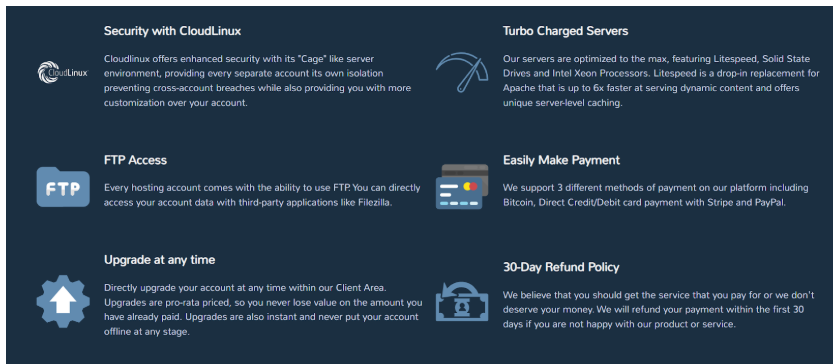

Asura Hosting offers straightforward pricing and modern technology, but when it comes to stability, support quality, and security, user opinions vary widely.

While the company claims 99.9% uptime, some customers report "noticeable slowdowns" and even "over eight hours of daily downtime." Several reviews also mention that the servers feel "overcrowded," making them a poor fit for performance-critical websites.

Reviews on the company's website and in several blogs describe the support team as "exceptional" and "very friendly." However, on other platforms, customer support is called "nonexistent" and "ineffective," with users complaining about ignored requests and unhelpful responses.

One user reported "constant hacks" and security issues, especially with passwords, noting the lack of two-factor authentication. Another major downside is that the company's website provides no contact details or physical address, which raises additional concerns about transparency.

### Key Evaluation Parameters

**Jurisdiction:** USA (Wyoming), part of Aquiryn, LLC

**Founders:** Aquiryn, LLC

**Founded:** 2012

**Revenue:** Not disclosed

**Data Centers & Locations:** USA, Canada, United Kingdom, South Africa, Netherlands, India

**Popular Plans:** Website Hosting from $1.00/month, VPS Hosting from $7.99/month

**Money-Back Guarantee:** 30-day money-back guarantee available

**Free Trial:** Not available

**Payment Methods:** Cryptocurrency (BTC), credit cards (via Stripe)

**Key Features:** NVMe SSD, LiteSpeed, no renewal price increases, 24/7 support, 99.99% uptime

**Additional Services:** Reseller hosting, VPS, radio hosting, domains

**Supported Software:** cPanel, DirectAdmin, CloudLinux, LiteSpeed, Softaculous, WordPress, WHMCS

**Security History:** No breaches reported

## AccuWeb Hosting

[AccuWeb Hosting](https://www.accuwebhosting.com/ref/5218-18-3-18.html) is a hosting provider with over 22 years of experience, offering a wide range of services. The company stands out for its focus on high-performance solutions, including Windows-based hosting.

One of its key advantages is the use of SSD storage with RAID10 technology, ensuring both speed and reliability. AccuWeb Hosting also emphasizes 24/7 customer support, available 365 days a year. The company offers WordPress-optimized solutions and supports a broad range of software, including the latest versions of PHP and MySQL.

Reviews are mostly positive. Users highlight "great speed," "fast response times," and "strong reliability." The company claims 99.99% uptime, and even 100% on certain plans.

Customer feedback often describes the support team as "very friendly," "quick," and "knowledgeable," capable of handling even complex technical issues. Reported response times are under 15 minutes for tickets and as fast as 7 seconds via live chat.

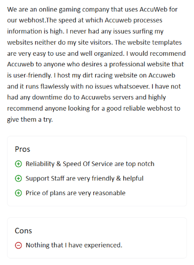 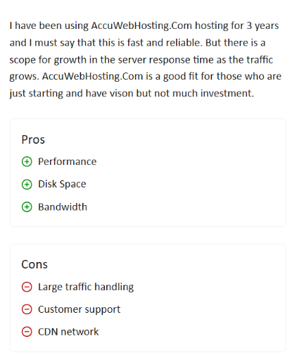

Pricing is generally described as "reasonable." However, some services — like DDoS protection and antivirus security — come at an additional cost. Overall, AccuWeb Hosting is seen as an experienced provider offering strong performance and high-quality support, as confirmed by the majority of user reviews.

### Key Evaluation Parameters

**Jurisdiction:** USA, New Jersey

**Founders:** Not disclosed

**Founded:** 2003

**Revenue:** $409.6K (2024)

**Data Centers & Locations:** USA, Germany, United Kingdom, India, Singapore, Australia

**Popular Plans:** WordPress Hosting from $1.99/month, Windows VPS from $6.33/month

**Money-Back Guarantee:** 30 days

**Free Trial:** 30 days

**Payment Methods:** American Express, Diners, Discover, JCB, MasterCard, PayPal, Visa

**Key Features:** Over 22 years of experience, 24/7/365 support, SSD storage with RAID10

**Additional Services:** Web & reseller hosting, WordPress, VPS, dedicated hosting

**Supported Software:** PHP 8.x, MySQL 8.x, ASP.Net Core, CloudLinux, LiteSpeed, cPanel/WHM

**Security History:** No breaches reported

## BigRock

[BigRock](https://bigrock-in.sjv.io/09vO5R) positions itself as one of India's leading hosting providers, which is reflected right in its .in domain. The company aims to be a one-stop shop for all things web — from domain registration to SEO optimization.

With over 10 years of experience, BigRock has earned a solid reputation in the market. Its status as an ICANN-accredited registrar further reinforces its credibility.

Some products come with a 30-day money-back guarantee. The company promises 99.9% uptime and describes its servers as "truly powerful."

Based on reviews, most users are satisfied and report no major performance issues.

Customer support, however, gets mixed feedback. Some call it "reliable" and "professional," while others say it's "not as good as expected."

Pricing is generally seen as affordable, especially for long-term plans, which come with generous discounts. Overall, BigRock presents itself as a versatile and dependable provider, though opinions on support quality remain divided.

### Key Evaluation Parameters

**Jurisdiction:** India

**Founder:** Bhavin Turakhia

**Founded:** 2009

**Revenue:** $50.6 million (2024)

**Data Centers & Locations:** India, USA

**Popular Plans:** Pricing starts at $3.84, though it depends on the INR/USD exchange rate

**Money-Back Guarantee:** 30-day guarantee for SSL certificates

**Free Trial:** Not available

**Payment Methods:** MasterCard, PayPal, Visa

**Key Features:** Part of the Endurance International Group, uses CloudLinux and LiteSpeed technologies

**Additional Services:** Domain registration, web hosting, email hosting, website builder, SSL certificates

**Supported Software:** cPanel, Plesk

**Security History:** No breaches reported

## DigitalOcean

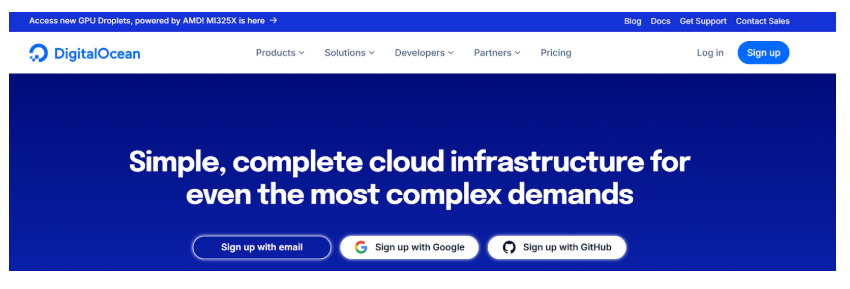

[DigitalOcean](https://m.do.co/c/abdc1660635e) is a cloud platform designed for developers, startups, and small businesses. Its main strengths are ease of use and predictable pricing, making it an attractive alternative to more complex cloud providers. The platform simplifies the process of deploying virtual machines — known as Droplets.

DigitalOcean offers a wide range of services, from virtual machines and Kubernetes clusters to managed databases and GPU-powered servers. The company guarantees 99.99% uptime and provides free personalized support, with optional paid plans for faster response times.

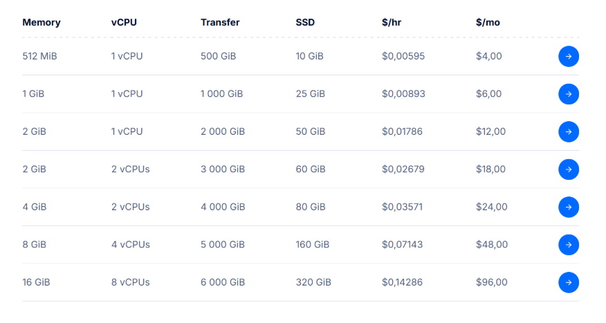

Reviews praise DigitalOcean for its speed and reliability. The company's claimed 99.99% uptime is backed by independent user testing, and server response times are described as "lightning-fast" — averaging around 300 ms.

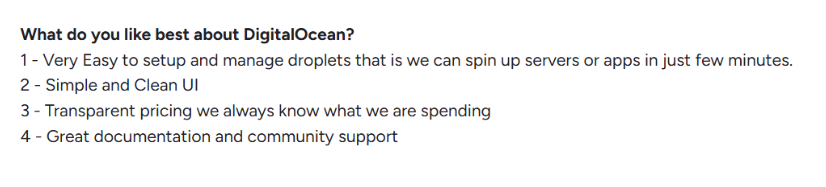

That said, opinions are mixed when it comes to customer support. On G2, users praise the team for "very quick responses," while HostAdvice points out low Trustpilot ratings (2.7/5) and the lack of phone support.

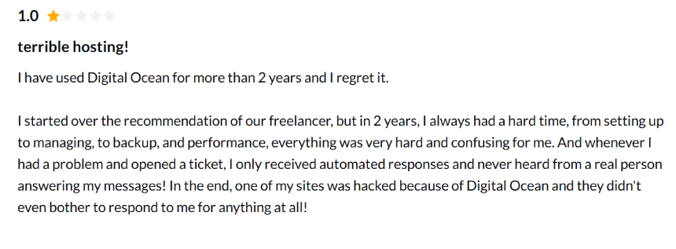

Beginners often find the platform "too complicated," while developers call it "the best option" thanks to its clean and intuitive interface. Since DigitalOcean was built with professionals in mind, it doesn't include beginner perks like a free domain, SSL certificate, or site migration.

Overall, DigitalOcean positions itself as a powerful and reliable cloud platform for developers. But because of its pro-focused nature and limited beginner support, it might feel overwhelming for newcomers.

### Key Evaluation Parameters

**Jurisdiction:** USA, New York

**Founders:** Jeff Carr, Mitch Wainer, Ben Uretsky, Alec Hartman, Moisey Uretsky

**Founded:** 2011

**Revenue:** $236 million (2024)

**Data Centers & Locations:** Global network of data centers

**Popular Plans:** Predictable pricing starting from $4.00/month

**Money-Back Guarantee:** Available within the first 7 days of use

**Free Trial:** Not available

**Payment Methods:** MasterCard, PayPal, Google Pay, Visa

**Key Features:** Developer-focused cloud platform, VPS-based infrastructure, simplicity, scalability, predictable pricing, 99.99% uptime SLA

**Additional Services:** Virtual machines (Droplets), Kubernetes, App Platform, Managed Databases, Storage, GPU servers

**Supported Software:** MongoDB, Linux-based operating systems such as Ubuntu, CentOS, and Debian

**Security History:** No breaches reported

## Kamatera

[Kamatera](https://go.cloudwm.com/visit/?bta=37073&nci=5693) offers enterprise-grade cloud infrastructure with a flexible pricing model, making it an ideal choice for projects with unpredictable or fluctuating workloads, where fixed monthly plans might lead to overpayment.

Its key advantage is the ability to precisely configure CPU, RAM, and storage, so you only pay for the resources you actually use.

The company guarantees 99.95% uptime and provides 24/7 customer support. A free trial is also available, allowing users to test the service risk-free.

However, many reviews raise serious concerns about billing transparency, with accusations of "fraud" and unauthorized credit card charges after the free trial ends.

On the performance side, feedback is largely positive — tests report "excellent performance" and "fast response times."

Opinions on support are divided. One user calls it "outstanding," while others complain about "zero help" when dealing with issues like spam originating from their servers. The platform itself requires technical knowledge, so beginners may find it challenging to navigate.

Overall, Kamatera delivers flexible and high-performance cloud infrastructure, but customer concerns about billing practices and security raise some red flags.

### Key Evaluation Parameters

**Jurisdiction:** Israel

**Founders:** The OMC Group

**Founded:** 1995

**Revenue:** Not disclosed

**Data Centers & Locations:** USA, Spain, Italy, Sweden, Germany, Israel, Japan, Australia, Singapore

**Popular Plans:** Custom-configured pricing starting from $4.00/month

**Money-Back Guarantee:** Available within 30 days

**Free Trial:** 30-day trial available

**Payment Methods:** MasterCard, Visa

**Key Features:** Scalability, flexible configurations, 99.95% uptime

**Additional Services:** VPS, Cloud Servers, Web/Development/Remote Desktop/WordPress Servers

**Supported Software:** Linux (various distributions), Windows

**Security History:** No breaches reported

## AlexHost

[AlexHost](https://bill.alexhost.com/?affid=1342) positions itself as a hosting provider focused on stability and security — a solution for those who value anonymity and protection from legal inquiries even more than performance or customer support.

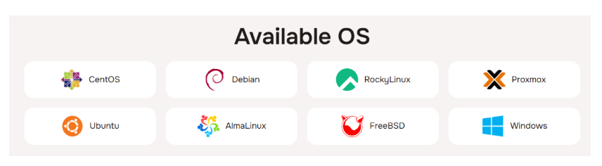

Among the company's strengths are a wide variety of payment options (including cryptocurrency) and strong physical data center security. AlexHost also provides DDoS protection and uses LiteSpeed technology.

The company claims 99.99% uptime and unlimited traffic, although most plans are capped at 100 Mbps port speed.

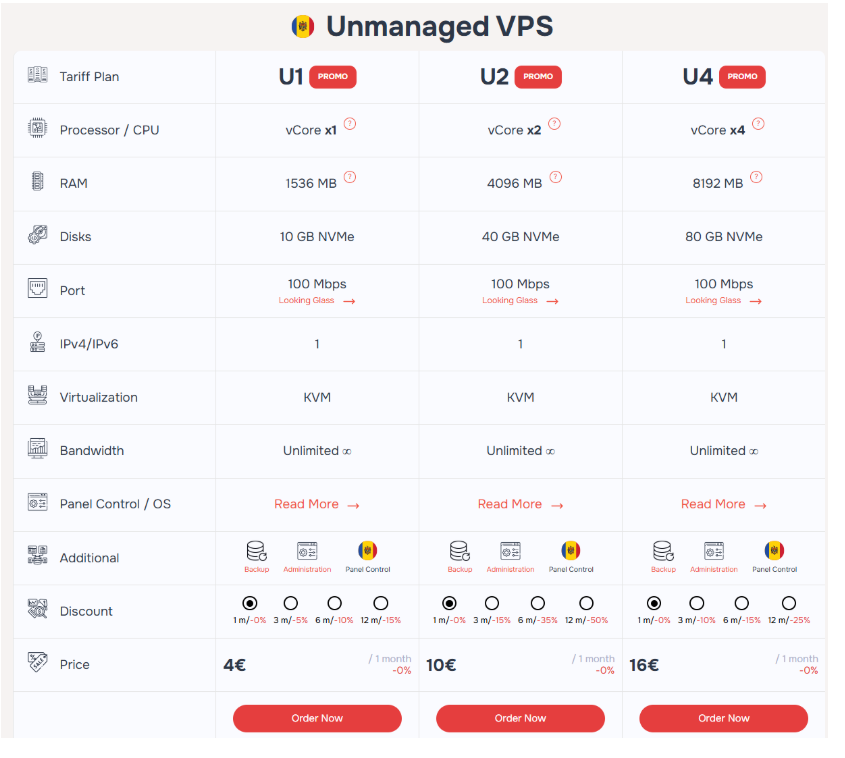

However, AlexHost can suspend servers for policy violations such as spam or phishing — meaning that even a legitimate customer might face downtime if another user on the same server breaks the rules.

Customer feedback is highly polarized. One user called AlexHost "the worst hosting company" due to email issues and unresponsive support, while others describe it as "very good" and praise the professionalism and responsiveness of the support team, noting quick replies and a willingness to help.

Overall, AlexHost markets itself as a specialized provider focused on privacy and security, but customer opinions on support quality and reliability vary widely.

### Key Evaluation Parameters

**Jurisdiction:** Moldova

**Founder:** Alexandr Scutaru

**Founded:** 2008

**Revenue:** Not disclosed

**Data Centers & Locations:** United Kingdom, Bulgaria, Moldova, Switzerland, France, Netherlands, Sweden

**Popular Plans:** Pricing starts with the U1 plan at $4.00/month

**Money-Back Guarantee:** 30-day period available

**Free Trial:** 30-day trial available

**Payment Methods:** Accepts a wide range of payment options, including credit cards, PayPal, and various cryptocurrencies such as Bitcoin, Ethereum, and Monero

**Key Features:** Stability, Anti-DDoS protection, LiteSpeed

**Additional Services:** VPS, Dedicated Servers

**Supported Software:** Debian 10/11/12, Ubuntu 18.04/20.04/22.04 LTS, CentOS 7, AlmaLinux 8, Rocky Linux 8, Windows Server 2016/2019/2022 (Standard, Datacenter, and Essentials editions)

**Security History:** No breaches reported

## FairyHosting

[FairyHosting](https://my.fairyhosting.com/aff.php?aff=370) is an Estonian hosting provider founded in 2021. The company positions itself as a business hosting leader for small and medium-sized enterprises across Europe and the CIS region. Its services include virtual (VDS/VPS) and dedicated servers, colocation, web hosting, as well as router rentals and SSL certificates.

The company claims to offer competitive pricing, high connection speeds for European users, and data protection compliant with EU regulations. It also provides an instant money-back guarantee.

Despite these advantages, FairyHosting is considered a high-risk choice for businesses. According to Estonian company registries, its legal entity, RJ Network OÜ, is listed as being under a "notice of deletion."

Many users view FairyHosting as risky for professional use.

On the other hand, some reviews highlight that the provider successfully handled a large-scale DDoS attack, demonstrating strong load resistance. Customers also praise the quick response times of the support team, which is described as prompt and helpful.

Overall, FairyHosting markets itself as an affordable business hosting provider with solid DDoS protection, but its uncertain legal status raises serious concerns about its reliability and long-term stability.

### Key Evaluation Parameters

**Jurisdiction:** Estonia

**Founder:** RJ Network OÜ

**Founded:** 2011

**Revenue:** Not disclosed

**Data Centers & Locations:** Estonia, Germany, Switzerland, China

**Popular Plans:** Pricing starts at $11.00/month

**Money-Back Guarantee:** Instant refund policy (no specific timeframe stated)

**Free Trial:** Not available

**Payment Methods:** Bank Transfer, PayPal, PaySera, Stripe (credit cards), Freekassa (RU cards), CoinGate, Alipay, YooMoney

**Key Features:** Competitive pricing in Estonia, high speed for European users, GDPR-compliant data protection

**Additional Services:** Business hosting, innovative infrastructure solutions

**Supported Software:** CentOS, Debian, Ubuntu, Fedora, FreeBSD, Windows Server, Proxmox VE, VMware ESXi

**Security History:** No breaches reported

## 2cloud

[2cloud](https://2cloud.eu/?from=83449) is a Latvian cloud provider focused on businesses that value reliability and flexibility. The company emphasizes transparency, openly publishing all of its legal details, including registration number and physical address.

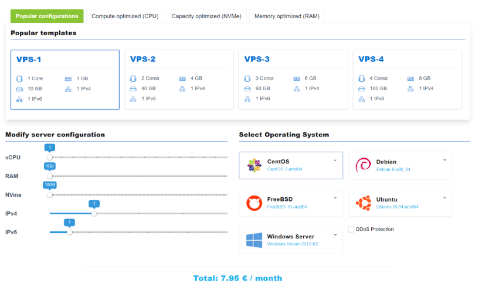

Its service portfolio includes IaaS, virtual (VPS/VDS) and dedicated server rentals, along with additional solutions like cloud migration, network consulting, IT security, and disaster recovery. Another unique offering is an IP blacklist removal service.

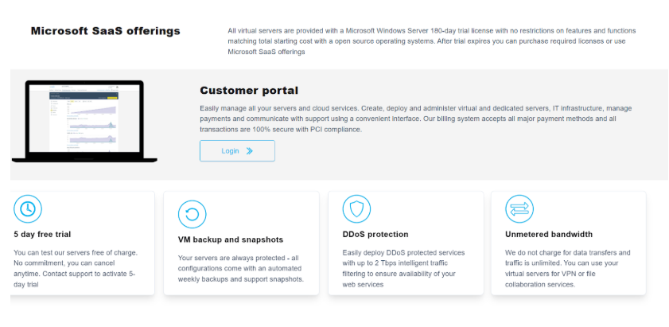

The company operates Tier III data centers with a claimed 99.95% uptime and uses a pay-as-you-go model, allowing clients to manage their costs more efficiently.

However, according to the user agreement, refunds for unused resources are only possible "by mutual agreement" — and are credited to the client's internal balance, without the option of withdrawal. Moreover, the claimed 99.95% availability doesn't align with user reports citing frequent outages in recent years.

Customer support quality appears to have declined significantly over time. While earlier feedback described it as "fast and responsive," more recent reviews call it "ineffective" and note that it often fails to provide timely assistance.

Users also criticize the value for money, saying that prices are high while reliability has dropped.

It's also important to note that, due to its server locations in Latvia, the provider isn't suitable for gaming servers or other latency-sensitive applications.

In summary, while 2cloud presents itself as a reliable and transparent provider, user feedback points to reliability issues, worsening support quality, and inflexible refund policies.

### Key Evaluation Parameters

**Jurisdiction:** Latvia, 2 Cloud Ltd.

**Founder:** 2 Cloud Ltd.

**Founded:** 2015

**Revenue:** Not disclosed

**Data Centers & Locations:** Riga, Latvia

**Popular Plans:** Pay-as-you-go model starting from around $8.00/month

**Money-Back Guarantee:** Refunds available by mutual agreement only

**Free Trial:** 5-day trial available

**Payment Methods:** Bank Transfer, PayPal, PaySera, Stripe (credit cards), Freekassa (RU cards)

**Key Features:** Tier III compliance, 99.95% uptime

**Additional Services:** IaaS, dedicated server rental, IT consulting, IT security

**Supported Software:** cPanel, ISPmanager, DirectAdmin, VestaCP

**Security History:** No breaches reported

## Vpsserver

[Vpsserver](https://go.cloudwm.com/visit/?bta=37073&nci=5693) is not an independent hosting provider but rather a trademark owned by Kamatera Inc., a subsidiary of The OMC Group.

The company offers a wide range of VPS services, focusing on flexibility, high performance, and ease of use. Vpsserver operates over 20 data centers worldwide, allowing clients to host their projects as close as possible to their target audience.

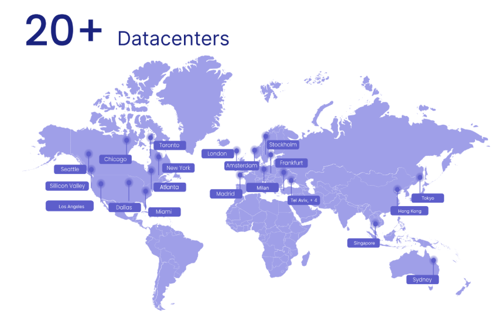

Key features include automatic deployment, preinstalled software, and an intuitive control panel. The platform provides both managed and unmanaged solutions, so each customer can choose the level of control they prefer. A free trial is also available.

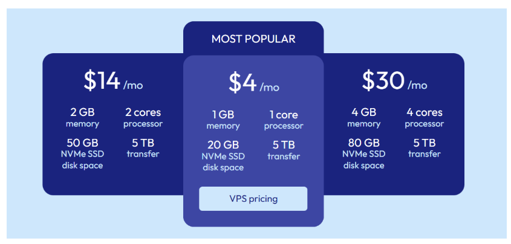

The service is best suited for projects that require scalable and flexible VPS hosting, particularly those needing Windows-based solutions.

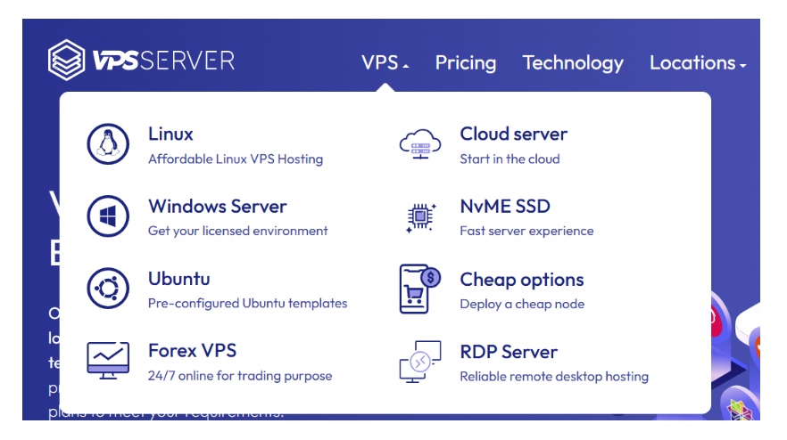

One positive review on G2 calls it a "very well-built VPS provider," noting that a slight delay during server setup isn't a big issue since it's a one-time process.

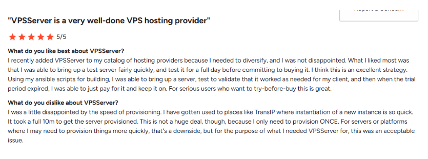

However, another user described the support team as "unresponsive" and "careless," claiming they were helpful only until the purchase was made.

### Key Evaluation Parameters

**Jurisdiction:** Headquarters in the USA (New York). Services are governed by the laws of Israel

**Founder:** Owned by Kamatera Inc.

**Founded:** 1995 / 2023 (year of acquisition)

**Revenue:** Not disclosed

**Data Centers & Locations:**

Facilities located across North America (New York, Chicago, Dallas, Miami, Atlanta, Los Angeles, Seattle, Silicon Valley), Europe (Amsterdam, London, Frankfurt, Milan, Madrid, Stockholm), Asia-Pacific (Hong Kong, Singapore, Tokyo), Middle East (Tel Aviv, Rosh HaAyin, Haifa, Petah Tikva), Australia (Sydney), and Canada (Toronto)

**Popular Plans:** VPS starting from $4.00/month

**Money-Back Guarantee:** Refunds are provided at the company's sole discretion and are not available if the AUP (Acceptable Use Policy) is violated

**Free Trial:** 30-day trial available (up to $100 in credit, credit card verification required)

**Payment Methods:** Accepts various payment options including credit cards and PayPal

**Key Features:** 20+ data centers, managed solutions, automation, NVMe SSD storage

**Additional Services:** Linux/Windows VPS, managed and self-managed hosting, security audits

**Supported Software:** Windows Server (2012, 2016, 2019, 2022), and popular Linux distributions such as Ubuntu, CentOS, CloudLinux, AlmaLinux, and Rocky Linux

**Security History:** No breaches reported

## Snel

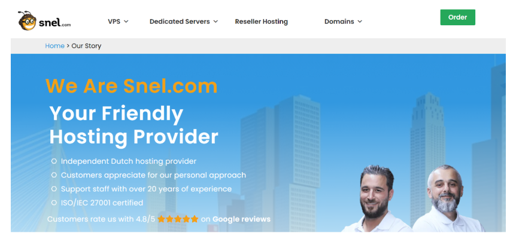

[Snel](https://my.snel.com/?affid=62619) is a Netherlands-based hosting provider that positions itself as a "green hosting company" powered entirely by renewable energy. The company stands out for its strong focus on sustainability and security, backed by ISO 27001 certification.

Snel combines high-performance infrastructure, strict security standards, and exceptional customer focus. Its limited number of data center locations in the Netherlands allows the company to maintain consistent service quality and localized reliability.

The provider offers a wide range of services, including VPS and dedicated servers, and supports 20+ payment methods, including cryptocurrencies. VPS plans start at €13.99/month, while Managed Pure Performance VPS plans begin at €136.99/month. The company also runs regular promotions — offering discounts of up to 87% on web hosting.

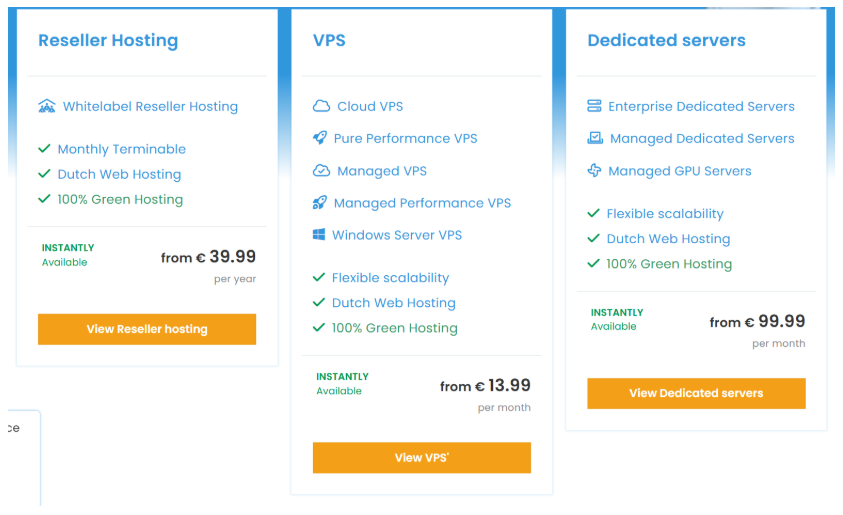

Reviews on Webhosters.nl highlight the platform's "very good speed" and "high VPS performance." On the company's own website, support is praised as "fast" and "friendly." However, another review on Webhosters.nl describes it as "terrible" and "slow," claiming that customer service stops responding after subscription cancellation.

Overall, Snel offers eco-friendly, high-performance hosting with a strong emphasis on security and sustainability, but customer support experiences appear to vary between users.

### Key Evaluation Parameters

**Jurisdiction:** Netherlands

**Founder:** Musti Aslan

**Founded:** Musti Aslan launched his first hosting company in the Netherlands around 2000, and the Snel brand was created in 2010 to expand internationally

**Revenue:** Not disclosed

**Data Centers & Locations:** Rotterdam, Netherlands

**Popular Plans:** VPS from €13.99/month, Dedicated Servers from €99.99/month

**Money-Back Guarantee:** No refund policy for any services

**Free Trial:** Not available

**Payment Methods:** In addition to standard credit cards (Visa, MasterCard), PayPal, and bank transfers, the company accepts iDEAL, SOFORT, Bancontact, and a wide range of cryptocurrencies, including Bitcoin, Ethereum, and Litecoin

**Key Features:** ISO 27001 certification

**Additional Services:** VPS, Dedicated Servers, Reseller Hosting, Domains

**Supported Software:** Windows Server and popular Linux distributions

**Security History:** No breaches reported

## VPS.TC

[VPS.TC](https://portal.vps.tc/?affid=246) is a Turkish hosting provider offering VPS servers at affordable prices in Turkish lira (₺). The company focuses on high-performance hardware and process automation.

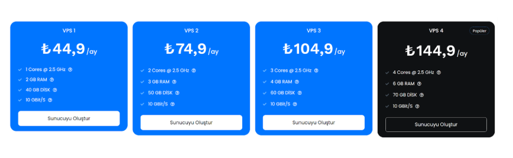

**Key Advantages:**

- Competitive pricing: The company claims to be the most affordable VPS provider in Turkey.
- Modern hardware: Uses NVMe SSD storage and 10 Gbps ports.
- Fast deployment: Servers are activated within seconds.

The provider uses VMware virtualization and also offers dedicated servers. However, VPS.TC operates from a single location — Istanbul, which creates a single point of failure and limits its appeal for clients outside the region.

While marketing materials promise an "unlimited" 10 Gbps connection, independent user tests tell a different story: download speeds averaged around 3-5 Gbps, and upload speeds appeared to be capped at 500 Mbps, far below the advertised rate.

User reports indicate that the core infrastructure is unstable. One customer purchased two servers and described them as "painfully slow."

A particularly notable incident occurred in May, when multiple servers failed simultaneously. The company attributed the issue to a problem with CEPH, its distributed storage system — a failure that points to a systemic issue rather than an isolated event. One affected customer received a $10 compensation, but their server never came back online and the hard drive was reported as "damaged."

Customer support is another weak spot. Reviews describe it as extremely slow or completely unresponsive. One user sent both a ticket and an email but never received a reply, while another said it took about two hours just to get an initial response.

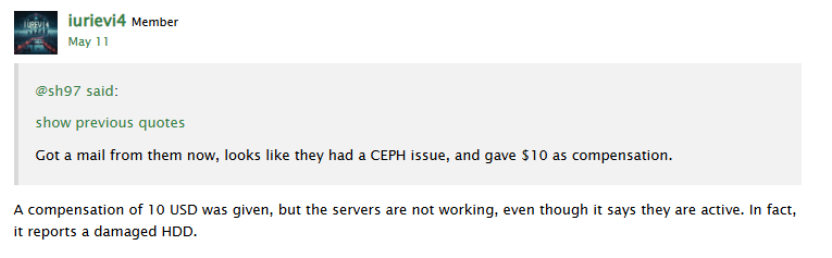

Overall, VPS.TC offers budget-friendly pricing and modern hardware, but its limited infrastructure, unreliable performance, and poor customer support make it a risky option for production environments.

### Key Evaluation Parameters

**Jurisdiction:** Turkey

**Founder:** Adem Er

**Founded:** Not disclosed

**Revenue:** Not disclosed

**Data Centers & Locations:** Turkey

**Popular Plans:** VPS from ₺44.4/month

**Money-Back Guarantee:** Available (no specific timeframe mentioned)

**Free Trial:** Not available

**Payment Methods:** Visa, MasterCard, PayPal, Bitcoin, Ethereum, Litecoin

**Key Features:** Fast activation, VMware virtualization, 10 Gbps network, 100% bare-metal dedicated servers

**Additional Services:** Cloud Servers, Dedicated Servers

**Supported Software:** Wide range of VPS and VDS plans using KVM virtualization and 100% NVMe SSD storage. Hardware reportedly includes Intel® Xeon E5-V4 processors and DDR4 ECC memory

**Security History:** No breaches reported

## MangoHost

[MangoHost](https://mangohost.net/?affid=3262) is a hosting provider that claims its team has 18 years of experience in the IT industry. The website lists Moldova as the company's registered location, but contact details point to another legal entity — TORTUGACLOUD SRL, based in Romania.

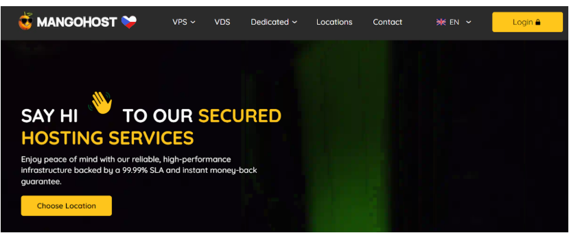

The company owns its own infrastructure, including a data center in Chișinău (Moldova), and also operates through partner locations in Zurich (Switzerland), Amsterdam (Netherlands), Kyiv (Ukraine), Chicago (USA), and Dubai (UAE). For example, the Chicago location is promoted as ideal for Forex traders, while Zurich is described as one of the most secure options in Europe.

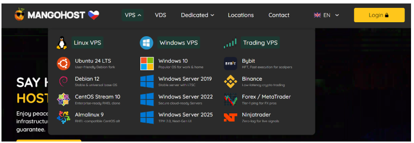

**Key Features of MangoHost**

- KVM virtualization — ensuring dedicated resources with no overselling.
- 99.99% uptime guarantee.
- Instant money-back guarantee.
- DDoS protection powered by Voxility.

VPS plans start at $7.20/month, while specialized trading VPS plans start at $9.50/month. Customers can get up to 20% off with long-term subscriptions.

Users consistently praise the server performance, noting that their VPS runs "very fast." Uptime data is especially impressive — some clients report over 600 or even 670 consecutive days without reboots or connectivity issues, confirming both the company's 99.9% uptime claim and its ownership of physical infrastructure.

However, the most serious issue mentioned in negative reviews is the lack of communication. Users report that support "disappears for days after payment" or responds "only once a day." One customer even mentioned being unable to reach support for five days.

If you're an experienced user who can handle configuration and maintenance independently, MangoHost can be a solid option, showcasing its strong infrastructure, uptime, and hardware quality.

But for anyone who needs reliable customer interaction — for migrations, billing issues, activation delays, or critical outages — the absence of dependable support channels makes this provider a risky choice.

### Key Evaluation Parameters

**Jurisdiction:** Moldova / Romania

**Founder:** Andrei Topal

**Founded:** 2019

**Revenue:** Not disclosed

**Data Centers & Locations:** MangoHost operates its own data center in Chișinău, Moldova, and provides services through partner locations in Zurich (Switzerland), Amsterdam (Netherlands), Kyiv (Ukraine), Chicago (USA), and Dubai (UAE)

**Popular Plans:** VPS from $7.60/month, Dedicated Servers from $29.99/month

**Money-Back Guarantee:** Instant refund promised. According to the user agreement, refunds are not provided for add-on services, licenses, or in cases of ToS violations or DDoS attacks

**Free Trial:** Not available

**Payment Methods:** Accepts credit cards (Mastercard, Visa), bank transfers (SEPA, SWIFT), payment systems (Google Pay, Paynet), and a wide range of cryptocurrencies including Bitcoin, Ethereum, Monero, Tether, and others

**Key Features:** Proprietary hardware, KVM virtualization, 99.99% uptime

**Additional Services:** Private VPN, Windows VPS, Binance VPS, Storage Box

**Supported Software:** Linux (Ubuntu), Windows (Windows Server 2019), HestiaCP, cPanel, DirectAdmin, Plesk, Virtualmin

**Security History:** No breaches reported

## VPS.one

[VPS.one](https://vps.one/?ref=16514) is a relatively new hosting provider, founded in 2022. The company focuses on delivering flexible, high-performance, and affordable VPS servers hosted in European data centers.

Its services include KVM VPS, Storage VPS, and SSL certificates. All plans run on SSD/NVMe storage and use KVM virtualization, ensuring both speed and security.

A key advantage is the wide range of payment options, including WebMoney and cryptocurrencies. The provider also offers additional services such as FTP hosting.

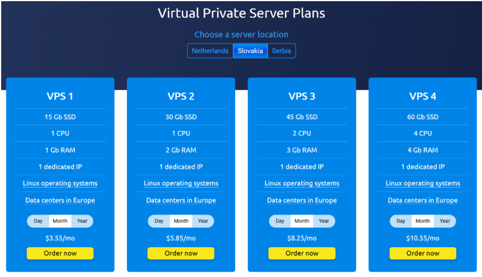

Users consistently praise the company's pricing, with one review calling it "the best value for VPS plans."

According to customer feedback, the servers perform reliably, with no downtime and excellent speed. The company itself claims to provide 24/7 technical support.

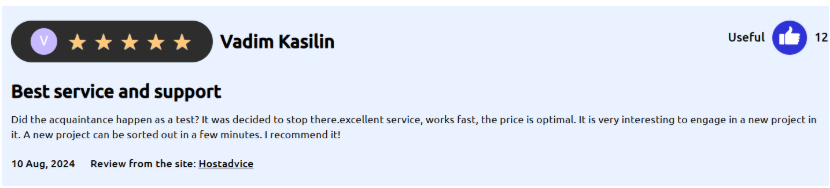

### Key Evaluation Parameters

**Jurisdiction:** Sharjah, UAE

**Founders:** Not disclosed

**Founded:** 2022

**Revenue:** Not disclosed

**Data Centers & Locations:** Netherlands, Slovakia, Serbia

**Popular Plans:** VPS 1 (15 GB SSD, 1 vCPU, 1 GB RAM) starting at $3.55/month

**Money-Back Guarantee:** Not available

**Free Trial:** Not available

**Payment Methods:** Credit card, WebMoney, cryptocurrency

**Key Features:** Fast activation, KVM virtualization, Tier III data centers, 24/7 support

**Additional Services:** SSL certificates, FTP hosting, storage VPS, affiliate program

**Supported Software:** 10+ Linux distributions (AlmaLinux, CentOS, Debian, Ubuntu)

**Security History:** No breaches reported

## Serva

[Serva.one](https://serva.one/?ref=10596) is a UK-based company offering cloud infrastructure and dedicated servers. While the company was officially established in 2007, it claims to have IT industry experience dating back to 1992.

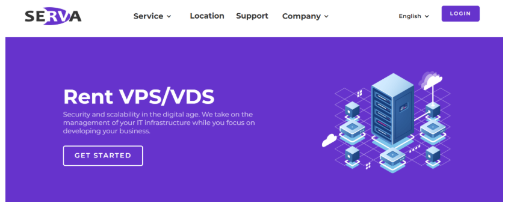

The provider offers several hosting plans. For instance, a basic configuration includes 1 GB of RAM, 1 CPU core, and 10 GB of NVMe SSD storage for €3 per month. All plans feature a 1 Gbps port with unlimited bandwidth. Unlike many competitors that allow for custom configurations, Serva.one uses predefined packages — convenient for beginners but limiting for advanced users who need flexibility.

On the performance side, some users report excellent results. One reviewer described their machine as "flying" and shared speed test data: 336.36 Mbps download and 308.01 Mbps upload.

However, these advantages are overshadowed by serious issues. The company's promise of 24/7 support with a 15-minute response time directly contradicts most customer feedback. One user complained about "very long" response times and the complete absence of support during evenings and nights, suggesting the company might be run by a single person named Dmitry.

Other customers echo similar concerns, describing support as "very poor" and "unresponsive." Some report waiting several days for a reply. In addition to slow responses, support is often defensive, deflecting blame back onto the client with comments like "There's no problem on our side — it's your issue."

Even more troubling is the refund policy. One user who requested a full refund after just 30 minutes of testing an unusable service was met with unfriendly treatment. The company only refunded one of multiple servers, citing "policy restrictions" that apparently don't allow refunds even for unused time.

Overall, Serva.one combines solid hardware and good network performance with serious customer service and refund concerns, making it a risky choice for anyone who values responsive support and transparency.

### Key Evaluation Parameters

**Jurisdiction:** United Kingdom

**Founder:** SERVA ONE LTD

**Founded:** 2007 (legal entity)

**Revenue:** Not disclosed

**Data Centers & Locations:** The company claims to operate data centers across several European countries and the USA, including the Netherlands, Germany, Romania, Poland, Latvia, Switzerland, and Italy

**Popular Plans:** Pricing starts at $3.00/month

**Money-Back Guarantee:** Refunds available only within 72 hours of account activation

**Free Trial:** Not available

**Payment Methods:** Visa and MasterCard via PayMaster, cryptocurrency

**Key Features:** Infrastructure in key global locations, guaranteed uptime, proprietary network equipment

**Additional Services:** Cloud infrastructure, Dedicated Servers

**Supported Software:** PHP, Python, Ruby, Node.js, Java; databases such as MySQL, PostgreSQL, MongoDB; popular CMS platforms (WordPress, Joomla, Drupal, Magento); and control panels like Plesk and cPanel, or direct SSH access

**Security History:** No breaches reported

## Hostman

[Hostman](https://hostman.com/r/bf743395) is a U.S.-based cloud service provider, founded in 2023. The platform is designed for developers, startups, and tech teams who want to focus on building products rather than managing infrastructure.

**Services Offered**

- High-performance servers powered by Intel and AMD processors with fast NVMe storage.
- Managed databases including MySQL, PostgreSQL, MongoDB, Redis, and more.
- Application hosting with seamless integration to GitHub and GitLab.

Hostman's servers are hosted in Tier III data centers certified under ISO/IEC 27001. Its global CDN network spans 45 points of presence, ensuring low latency and high bandwidth. The company guarantees 99.98% uptime and compliance with GDPR and PCI DSS standards.

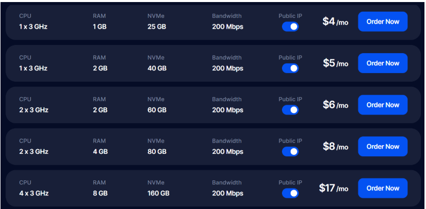

Hostman uses a pay-as-you-go pricing model with hourly billing. Entry-level cloud servers start at $4/month, while app hosting begins at $1/month. However, there's a contradiction in pricing documentation — some materials list backups and support as free, while others mark them as paid add-ons.

User feedback is generally positive, especially about customer support. The company offers 24/7 assistance via live chat, email, and documentation, with live chat being noted as the fastest response channel.

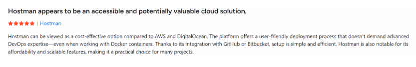

The main advantage of Hostman, repeatedly mentioned in reviews, is its exceptional simplicity. The platform is described as "intuitive" and "incredibly easy to use", allowing users to launch projects quickly without wrestling with complex server configurations.

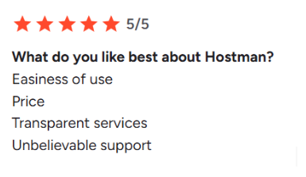

Hostman has successfully positioned itself between complex, enterprise-grade cloud providers and basic, limited hosting platforms. It delivers a balanced mix of performance, simplicity, and accessibility, making it a strong choice for its target audience.

### Key Evaluation Parameters

**Jurisdiction:** New York, USA

**Founder:** Hostman LTD

**Founded:** 2023

**Revenue:** Not disclosed

**Data Centers & Locations:** Confirmed locations include data centers in San Francisco, New York, San Jose, and New Jersey (USA), as well as Amsterdam (Netherlands). The company plans to expand into Singapore, Egypt, and Nigeria.

**Popular Plans:** Cloud servers and managed databases start from $4.00/month, while app hosting plans begin at $1.00/month

**Money-Back Guarantee:** Mentioned on the official website, but no detailed documentation on terms, duration, or exclusions is provided

**Free Trial:** Not available

**Payment Methods:** Credit cards and PayPal only

**Key Features:** Each cloud server and VPS includes a 200 Mbps network channel with unlimited bandwidth, allowing stable performance even under heavy loads

**Additional Services:** Cloud Servers, Cloud Databases, App Hosting (GitHub, GitLab, Bitbucket integrations)

**Supported Software:** MySQL, PostgreSQL, MongoDB, Redis, Apache Kafka, OpenSearch, WordPress

**Security History:** No breaches reported

## RackNerd

[RackNerd](https://my.racknerd.com/aff.php?aff=15133) is a hosting provider known for its focus on stability and global coverage. The company operates 21 data centers across 20 worldwide locations, minimizing latency for international projects.

Its service portfolio includes VPS, dedicated servers, hybrid servers, and shared hosting. RackNerd uses Intel Xeon and AMD EPYC/Ryzen processors, with SSD/NVMe RAID-10 storage and 1 Gbps network ports optimized for high-speed performance.

The company is well known for its aggressive pricing and frequent promotional deals, accepting multiple payment methods including cryptocurrency. However, several online communities have raised serious allegations against the founder, referencing past hosting ventures that abruptly shut down, leaving customers without access to their data. Some reviews also mention slow disk speeds and frequent outages.

Opinions about RackNerd are sharply divided. On HostAdvice, the company holds an impressive 4.5/5 rating from 36 reviews and even earned the Excellent Service Award 2023. Users describe their experience as "flawless" and note that they're getting better performance for less money compared to providers like DigitalOcean. Many positive reviews praise fast disks, 100% uptime, and responsive customer support.

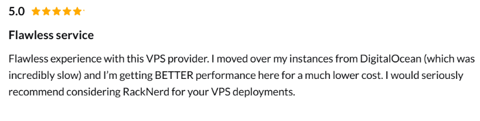

On the flip side, other sources paint a less flattering picture. Hosting101.ru reports that 100% of respondents consider RackNerd expensive, and 67% complain about unhelpful support that provides only template responses. Reddit discussions also mention network issues, packet loss, and a "nearly useless" cPanel hosting service that stops functioning after 11 months.

Despite the mixed feedback, many customers attracted by promotions say RackNerd offers outstanding value for money. One user claimed to have saved $70 per month compared to their previous provider while getting a more powerful server.

VPS deployment takes less than 10 minutes after payment, thanks to full automation — part of the company's mass-service strategy. However, this automation may lead to insufficient resource checks, including reused or blacklisted IP addresses.

While some customers report 100% uptime, others note that the company's status page shows daily incidents, suggesting underlying instability in the infrastructure.

Overall, RackNerd delivers affordable hosting with broad global reach, but inconsistent reliability and divided customer sentiment make it a provider best suited for non-critical projects or budget-conscious users.

### Key Evaluation Parameters

**Jurisdiction:** United States

**Founder:** Dustin B. Cisneros

**Founded:** 2019

**Revenue:** $5 million (2024)

**Data Centers & Locations:** 21 data centers across 20 locations in North America, Europe, and Asia

**Popular Plans:** N/A

**Money-Back Guarantee:** Not available

**Free Trial:** Not available

**Payment Methods:** Credit cards (Visa, MasterCard, American Express, Discover), PayPal, cryptocurrencies (Bitcoin, Bitcoin Cash, Litecoin, Ethereum, USDT, USDC), Alipay, and wire transfers

**Key Features:** Infrastructure stability, wide global coverage

**Additional Services:** VPS, Dedicated Servers, Affiliate Program

**Supported Software:** Linux (e.g., Ubuntu, Debian, CentOS) and Windows Server

**Security History:** No breaches reported

## How to Choose a Hosting Provider You Won't Regret

Choosing a VPS hosting provider isn't just about buying a service — it's about laying the foundation your entire project will stand on. Your server determines how fast your website loads, how secure your data is, and ultimately, how successful your online presence becomes. Let's break down how to make the right choice.

### Types of Hosting

To make an informed decision, it helps to know what kinds of hosting exist and how they differ.

| Hosting Type | Description | Best For | Pros | Cons |
|---|---|---|---|---|
| **Shared Hosting** | Multiple websites share the same physical server and its resources. | Personal blogs, portfolios, and small websites with light traffic. | Very affordable, easy to set up, no technical skills required. | Limited resources, lower performance under load, your site depends on "neighbors." |
| **VPS (Virtual Private Server)** | A virtual machine on a physical server with guaranteed resources. | Growing projects, online stores, company sites, and medium-traffic services. | Higher performance, full control, flexible configuration. | Requires basic server admin skills, more expensive than shared hosting. |
| **Dedicated Server** | You rent the entire physical server — all resources are yours. | Large corporations, high-load systems, mission-critical infrastructure. | Maximum performance and security, total control, no neighbors. | Expensive, needs advanced technical knowledge. |
| **Cloud Hosting** | Your resources come from a network of interconnected servers, not just one machine. | Startups and projects with variable or unpredictable traffic. | Scalable, pay only for what you use, highly reliable. | Pricing can fluctuate, setup can be tricky for beginners. |

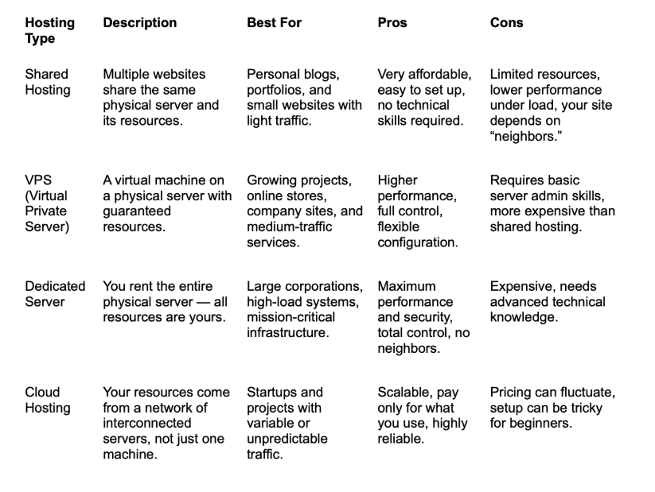

### What to Look For

A smart hosting choice comes down to a few key factors.

**Managed vs. Unmanaged**

Your choice depends on your technical confidence. With unmanaged VPS, you're in full control — but also fully responsible. You'll install software, configure security, and troubleshoot issues yourself. That's great for developers and sysadmins.

If you just want your project to run without babysitting servers, go with managed VPS — professionals will take care of maintenance, while you focus on your business.

**Windows or Linux**

Most providers offer both. Linux is cheaper and open-source — perfect for most web projects. If your stack relies on Microsoft software, Windows VPS is the way to go.

**Server Configuration**

Your server's specs directly affect speed. Make sure you have enough CPU power, RAM, and storage. Look for NVMe drives and hardware from reputable brands — you don't want to build your house on shaky ground.

**Reliability and Scalability**

Aim for uptime guarantees of at least 99.95%. The provider should also scale resources quickly as your traffic grows. Solid redundancy and network backup mean your site stays online no matter what.

Bonus points if they offer DDoS protection, automated backups, and SSL certificates right out of the box.

**Where Your Users Are**

The closer your data center is to your audience, the faster your site loads. It's not just about convenience — it also helps your SEO. Hosting in the same region as your customers can make a real difference.

**Don't Forget the Details**

Check that the plan meets your project's needs in terms of performance, storage, and bandwidth. NVMe SSDs deliver maximum speed, and estimating your CPU and RAM requirements upfront will save headaches later.

### How to Check Hosting Quality

Even after your project goes live, you should keep an eye on how your server performs.

**Uptime Monitoring**

To make sure your website stays online, use uptime tracking tools. Services like UptimeRobot are a simple, free way to monitor availability every few minutes and get alerts via email or Telegram if something goes wrong. If you need deeper insights, Pingdom offers detailed reports and checks from multiple locations around the world, while Host-Tracker adds extra diagnostics — from ping tests to port monitoring — and sends alerts through different channels.

**Speed Testing**

Speed directly affects user experience and SEO, so it's worth testing regularly. Google PageSpeed Insights is the go-to option — it measures key metrics like how quickly your page's first elements appear and how stable the layout feels during load. For deeper technical data, GTmetrix shows you a "waterfall" of all resources your site loads and how long each one takes. Finally, WebPageTest lets you simulate page loads from different regions, browsers, and network speeds — useful for spotting issues your users might face.

### Final Thoughts: Which Hosting Should You Choose?

Choosing a server isn't just a technical step — it's a strategic investment in your project's future.

Unlike shared hosting, where you compete for resources with hundreds of others, VPS or VDS hosting gives you full control — along with stability, security, and consistent performance.

In this guide, we've reviewed over 20 hosting providers — each with its own strengths. From premium managed services to budget-friendly options, there's something for every project and every budget.

If flexibility and scalability are your top priorities, check out DigitalOcean or Kamatera with their pay-as-you-go pricing.

For high performance at a reasonable cost, consider providers with established track records.

If your project targets a specific region, consider location-specific providers.

And if you want maximum reliability and a fully managed environment, look for providers with strong reputations for support and uptime.

The opinions in this article reflect real user experiences and verified facts. The right infrastructure doesn't just keep your site online — it helps your project grow, scale, and deliver the seamless experience your users expect.

---

## Table of Contents

- [Why Your Own Server Is More Than Just Hosting](#why-your-own-server-is-more-than-just-hosting)
- [Types of Hosting](#types-of-hosting)
- [Why VPS Is Worth It](#why-vps-is-worth-it)
- [What's Inside This Guide](#whats-inside-this-guide)
- [In-Depth Hosting Provider Review](#in-depth-hosting-provider-review)
- [is*hosting](#ishosting)
- [Aeza](#aeza)
- [VDSina](#vdsina)
- [Cherry Servers](#cherry-servers)
- [Webdock](#webdock)
- [Friend Hosting](#friend-hosting)
- [Asura Hosting](#asura-hosting)
- [AccuWeb Hosting](#accuwebhosting)
- [BigRock](#bigrock)
- [DigitalOcean](#digitalocean)
- [Kamatera](#kamatera)
- [AlexHost](#alexhost)
- [FairyHosting](#fairyhosting)
- [2cloud](#2cloud)
- [Vpsserver](#vpsserver)
- [Snel](#snel)
- [VPS.TC](#vpstc)
- [MangoHost](#mangohost)
- [VPS.one](#vpsone)
- [Serva](#serva)
- [Hostman](#hostman)
- [RackNerd](#racknerd)
- [How to Choose a Hosting Provider You Won't Regret](#how-to-choose-a-hosting-provider-you-wont-regret)
- [Final Thoughts](#final-thoughts-which-hosting-should-you-choose)

---

**Last updated:** November 2025

**Original source:** Article compiled from multiple hosting reviews and user feedback (2025-2026)

**Notes:** All images should be placed in `./images/` folder relative to this markdown file. Update image paths if your folder structure differs.
